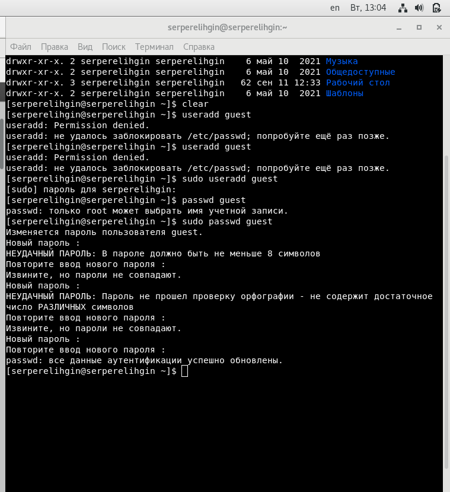
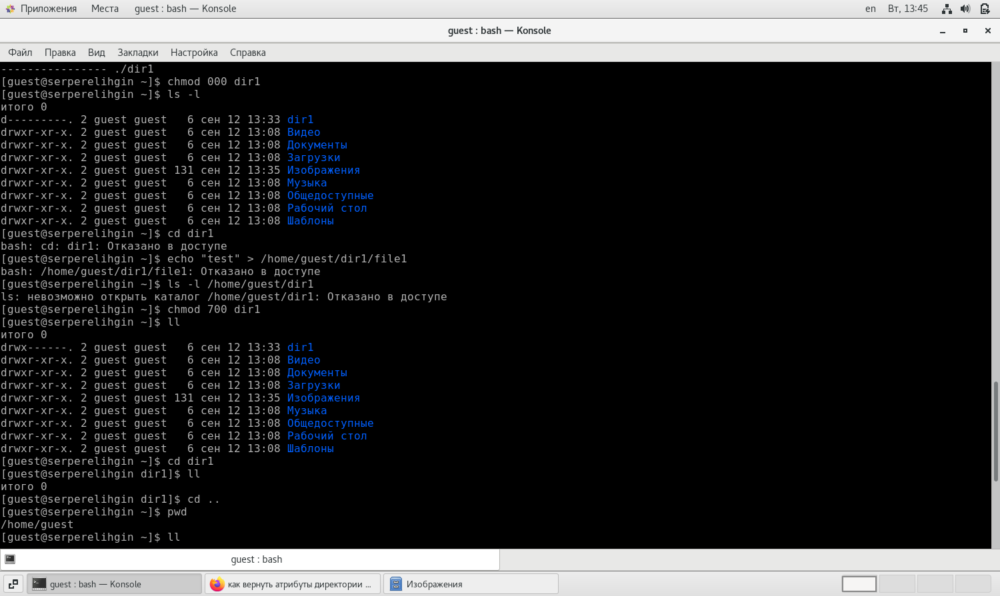
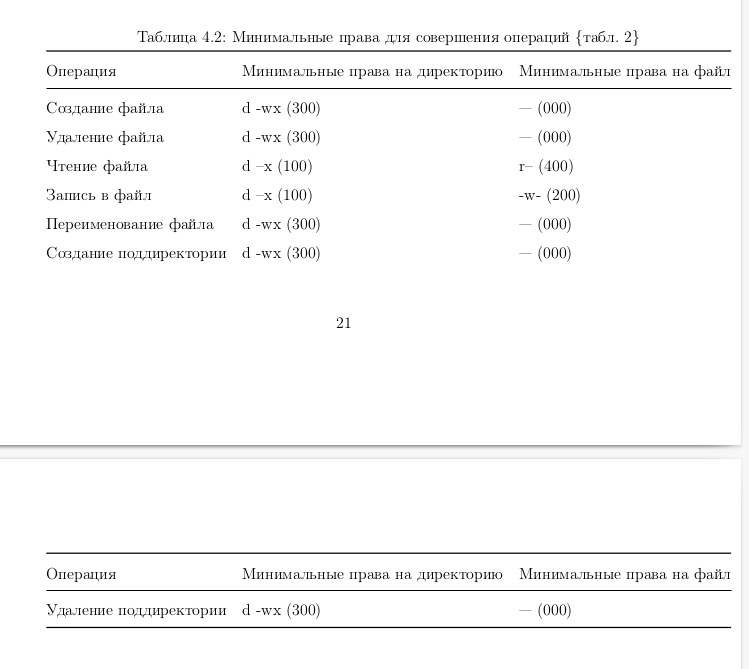

---
## Front matter
lang: ru-RU
title: Отчет по лабораторной работе №2
author: Перелыгин Сергей Викторович

## Formatting
mainfont: PT Serif
romanfont: PT Serif
sansfont: PT Sans
monofont: PT Mono
toc: false
slide_level: 2
theme: metropolis
aspectratio: 43
section-titles: true
---

# Цель работы

## Цель лабораторной работы

Получение практических навыков работы в консоли с атрибутами файлов, закрепление теоретических основ дискреционного разграничения доступа в современных системах с открытым кодом на базе ОС Linux.

# Выполнение лабораторной работы

## Начало выполнения работы

Сначала я создал новую учетную запись guest и зашел в систему под новым именем пользователя.
Затем я удостоверился, что действительно зашел от имени guest, сравнил результаты выполнения команд “id” и “groups”.

---

{ #fig:001 width=70% }

## Права доступа

После этого я ознакомился с правами доступа. Проанализировал и удостоверился, что будет, если снять с директории определенные права доступа.

---

{ #fig:001 width=70% }

## Заполняем таблицы

Затем я заполнил таблицы "Установленные права и разрешённые действия" и "Минимальные права для совершения операций".

---

{ #fig:001 width=70% }

# Выводы

## Вывод

В ходе выполнения данной лабораторной работы я приобрел практические
навыки работы в консоли с атрибутами файлов, закрепил теоретические основы дискреционного разграничения доступа в современных системах с открытым кодом на базе ОС Linux.

---
Спасибо за внимание!

