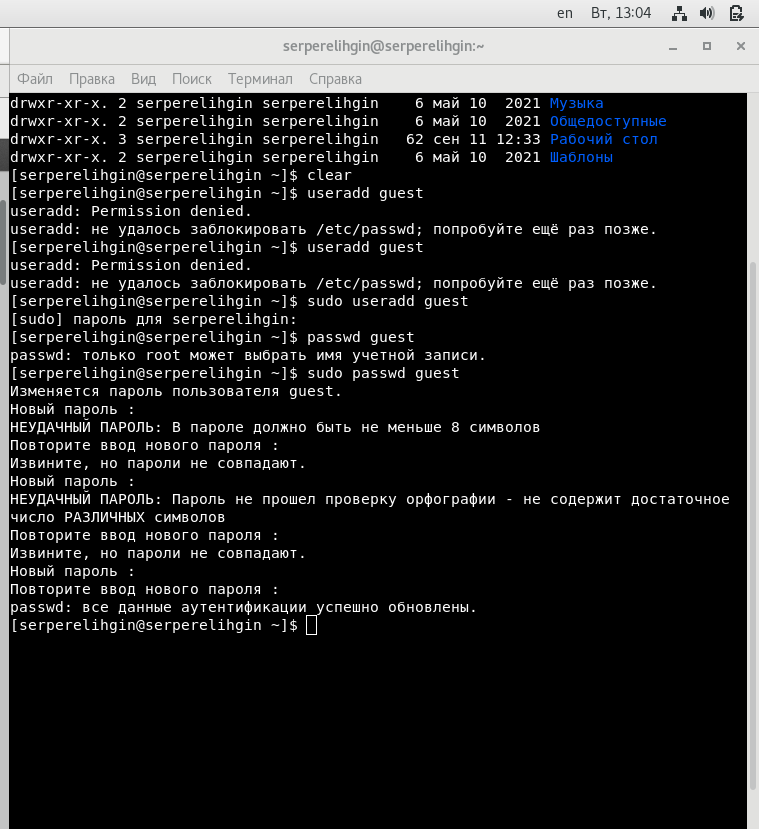
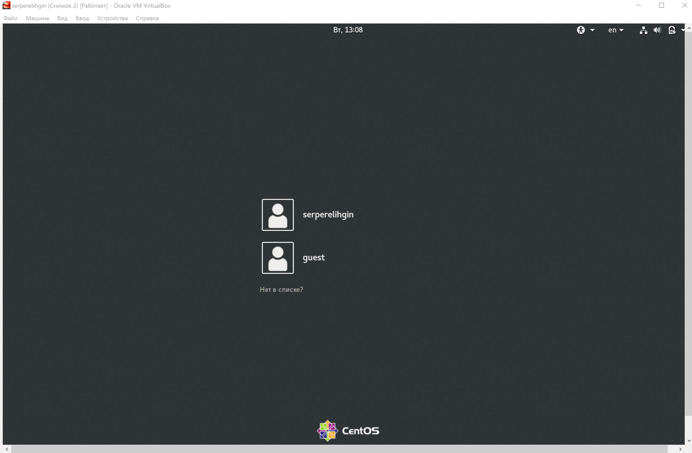
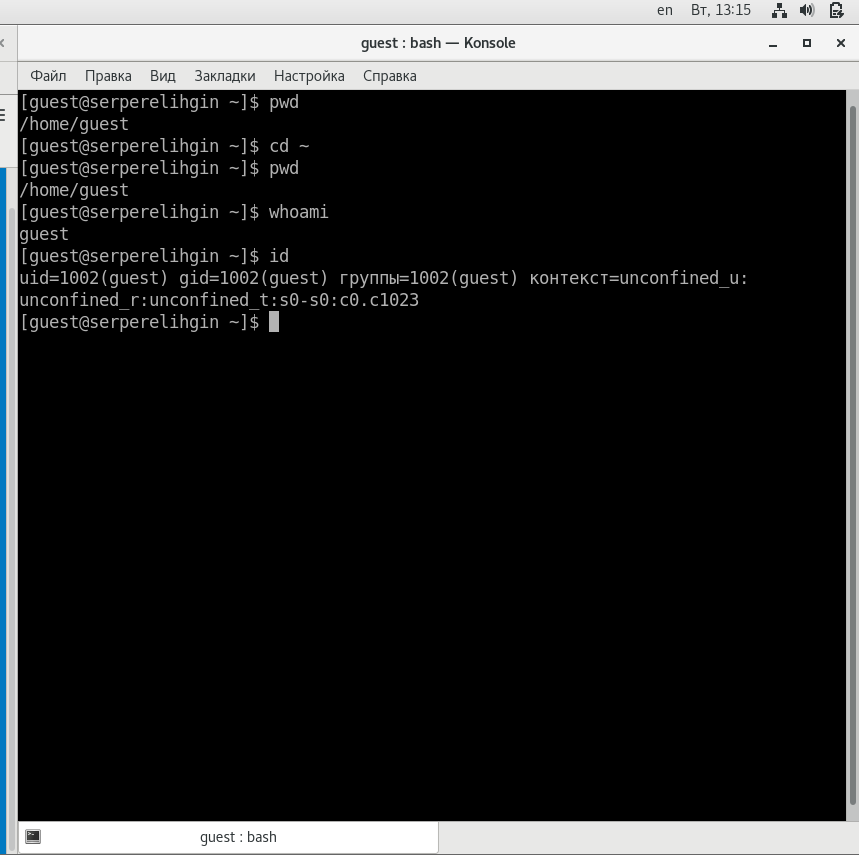
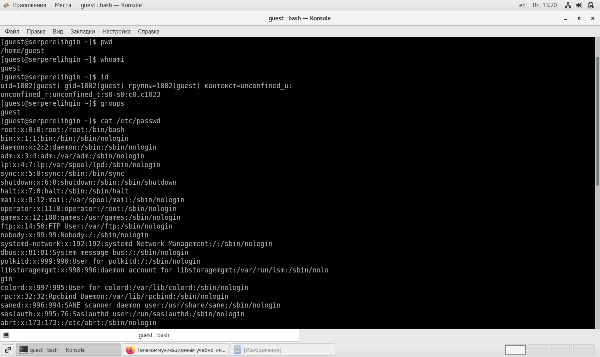
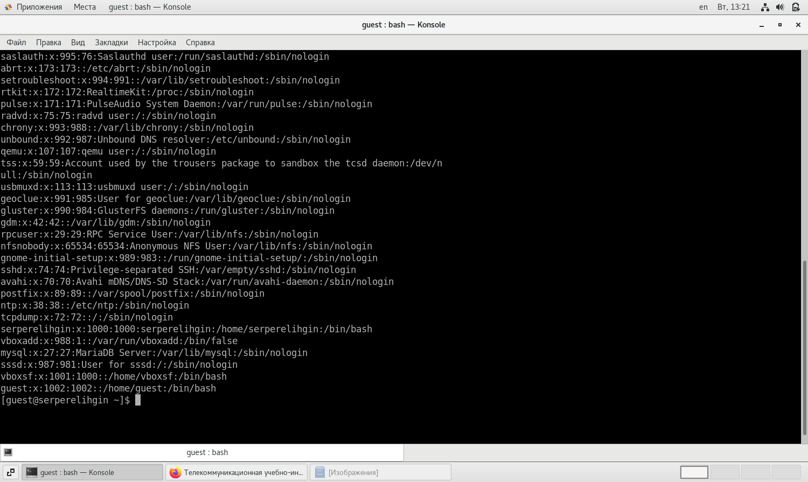
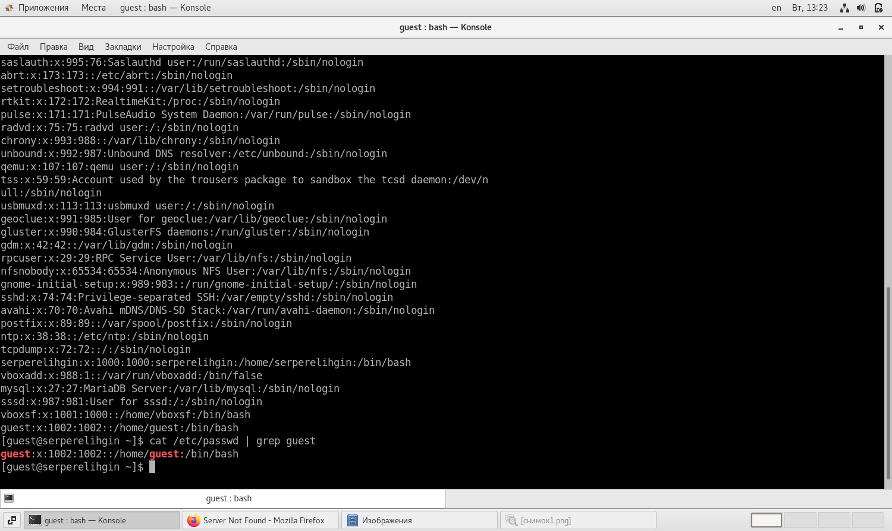
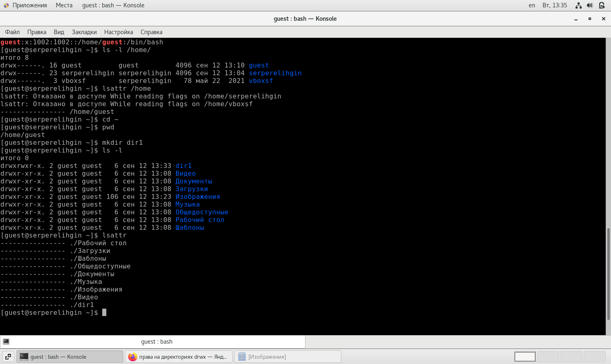
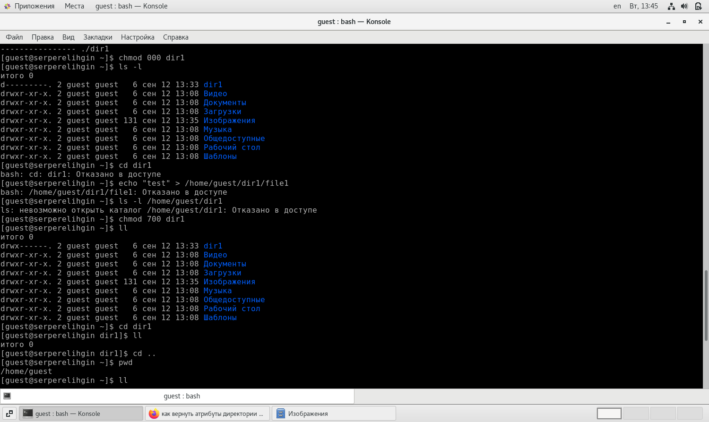
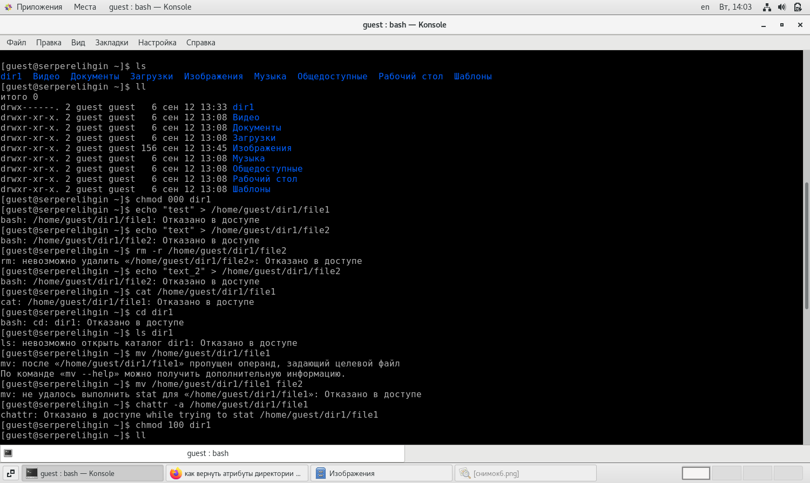
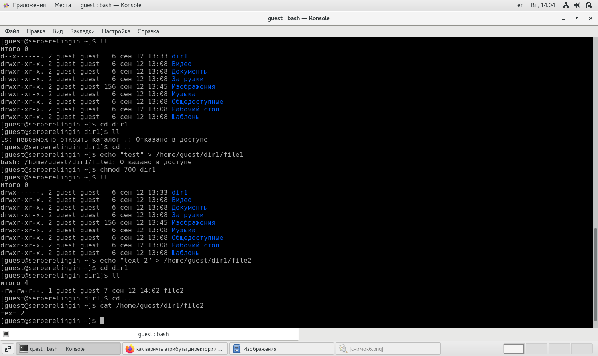

---
# Front matter
lang: ru-RU
title: "Отчёт по лабораторной работе № 2"
subtitle: "Дисциплина:	Основы информационной безопасности"
author: "Перелыгин Сергей Викторович"

# Formatting
toc-title: "Содержание"
toc: true # Table of contents
toc_depth: 2
lof: true # List of figures
fontsize: 12pt
linestretch: 1.5
papersize: a4paper
documentclass: scrreprt
polyglossia-lang: russian
polyglossia-otherlangs: english
mainfont: PT Serif
romanfont: PT Serif
sansfont: PT Sans
monofont: PT Mono
mainfontoptions: Ligatures=TeX
romanfontoptions: Ligatures=TeX
sansfontoptions: Ligatures=TeX,Scale=MatchLowercase
monofontoptions: Scale=MatchLowercase
indent: true
pdf-engine: lualatex
header-includes:
  - \linepenalty=10 # the penalty added to the badness of each line within a paragraph (no associated penalty node) Increasing the value makes tex try to have fewer lines in the paragraph.
  - \interlinepenalty=0 # value of the penalty (node) added after each line of a paragraph.
  - \hyphenpenalty=50 # the penalty for line breaking at an automatically inserted hyphen
  - \exhyphenpenalty=50 # the penalty for line breaking at an explicit hyphen
  - \binoppenalty=700 # the penalty for breaking a line at a binary operator
  - \relpenalty=500 # the penalty for breaking a line at a relation
  - \clubpenalty=150 # extra penalty for breaking after first line of a paragraph
  - \widowpenalty=150 # extra penalty for breaking before last line of a paragraph
  - \displaywidowpenalty=50 # extra penalty for breaking before last line before a display math
  - \brokenpenalty=100 # extra penalty for page breaking after a hyphenated line
  - \predisplaypenalty=10000 # penalty for breaking before a display
  - \postdisplaypenalty=0 # penalty for breaking after a display
  - \floatingpenalty = 20000 # penalty for splitting an insertion (can only be split footnote in standard LaTeX)
  - \raggedbottom # or \flushbottom
  - \usepackage{float} # keep figures where there are in the text
  - \floatplacement{figure}{H} # keep figures where there are in the text
---

# Цель работы

Получение практических навыков работы в консоли с атрибутами файлов, закрепление теоретических основ дискреционного разграничения доступа в современных системах с открытым кодом на базе ОС Linux.

# Задание

- Сделать отчёт по лабораторной работе в формате Markdown.
- В качестве отчёта предоставить отчёты в 3 форматах: pdf, docx и md.

# Выполнение лабораторной работы

1. В установленной при выполнении предыдущей лабораторной работы операционной системе создаю учётную запись пользователя guest (использую учётную запись администратора): sudo useradd guest и задаю пароль для этого пользователя командой “sudo passwd guest” (рис. 1).

{ #fig:001 width=70% }

2. Далее я зашел в систему от имени пользователя guest (рис. 2).

{ #fig:001 width=70% }

3. Командой pwd определил директорию, в которой нахожусь. Сравнил её с приглашением командной строки: является моей домашней директорией (рис. 3).

4. Уточнил имя моего пользователя командой whoami и получил вывод: guest (рис. 3).

5. С помощью команды “id” определил имя своего пользователя - всё так же guest, uid = 1002 (guest), gid = 1002 (guest) (рис. 3). 

{ #fig:001 width=70% }

6. Затем сравнил полученную информацию с выводом команды “groups”, которая вывела “guest”. Мой пользователь входит только в одну группу, состоящую из него самого, поэтому вывод обеих команд “id” и “groups” совпадает (рис. 4). Данные, выводимые в приглашении командной строки, совпадают с полученной информацией (рис. 4).

Затем просмотрел файл /etc/passwd командой “cat /etc/passwd” (рис. 4).

{ #fig:001 width=70% }

7. Нашел в нём свою учётную запись в самом конце (рис. 5). Uid = 1002, gid = 1002, то есть они совпадают с тем, что мы получили ранее.

{ #fig:001 width=70% }

Также использовал для поиска команду cat /etc/passwd | grep guest (рис. 6).

{ #fig:001 width=70% }

8. Посмотрел, какие директории существуют в системе командой “ls -l /home/” (рис. 7). Список поддиректорий директории /home получить удалось. На директориях установлены права чтения, записи и выполнения для самого пользователя (для группы и остальных пользователей никаких прав доступа не установлено).
Проверил, какие расширенные атрибуты установлены на поддиректориях, находящихся в директории /home, командой “lsattr /home” (рис. 7). Удалось увидеть расширенные атрибуты только директории того пользователя, от имени которого я нахожусь в системе.
Создал в домашней директории поддиректорию dir1 командой “mkdir dir1” и определил, какие права доступа и расширенные атрибуты были на неё выставлены: чтение, запись и выполнение доступны для самого пользователя и для группы, для остальных - только чтение и выполнение, расширенных атрибутов не установлено (рис. 7).

{ #fig:001 width=70% }

9. Снял с директории dir1 все атрибуты командой “chmod 000 dir1” и проверил с её помощью правильность выполнения команды “ls -l”. Действительно, все атрибуты были сняты (рис. 8).
Попытался создать в директории dir1 файл file1 командой echo “test” > /home/guest/dir1/file1 (рис. 8). Этого сделать не получилось, т.к. предыдущим действием мы убрали право доступа на запись в директории. В итоге файл не был создан (открыть директорию с помощью команды “ls -l /home/guest/dir1” изначально тоже не удалось по той же причине, поэтому я поменял права доступа и снова воспользовался этой командой, и тогда смог просмотреть содержимое директории, убедившись, что файл не был создан).

{ #fig:001 width=70% }

10. Заполним таблицу «Установленные права и разрешённые действия»(рис. 9-10).
Создание файла: “echo ”text” > /home/guest/dir1/file2”
Удаление файла: “rm -r /home/guest/dir1/file2”
Запись в файл: “echo ”text_2” > /home/guest/dir1/file2”
Чтение файла: “cat /home/guest/dir1/file1”
Смена директории: “cd dir1”
Просмотр файлов в директории: “ls dir1”
Переименование файла: “mv /home/guest/dir1/file1 file2”
Смена атрибутов файла: “chattr -a /home/guest/dir1/file1”

{ #fig:001 width=70% }

{ #fig:001 width=70% }

11. Заполним таблицы.

В случае успеха будет записывать +, в случае ошибки доступа будем записывать -. Соберём данные в таблицу 1.

: Установленные права и разрешённые действия {табл. 1}

| Права директории | Права файла | Создание файла | Удаление файла | Запись в файл | Чтение файла | Смена директории | Просмотр файлов в директории | Переименование файла | Смена атрибутов файла |
| ---------------- | ----------- | -------------- | -------------- | ------------- | ------------ | ---------------- | ------------------- | ----------- | ---------- |
| d (000) | (000) | - | - | - | - | - | - | - | - |
| d --x (100) | (000) | - | - | - | - | + | - | - | - |
| d -w- (200) | (000) | - | - | - | - | - | - | - | - |
| d -wx (300) | (000) | + | + | - | - | + | - | + | - |
| d r-- (400) | (000) | - | - | - | - | - | + | - | - |
| d r-x (500) | (000) | - | - | - | - | + | + | - | - |
| d rw- (600) | (000) | - | - | - | - | - | + | - | - |
| d rwx (700) | (000) | + | + | - | - | + | + | + | - |
| d (000) | --x (100) | - | - | - | - | - | - | - | - |
| d --x (100) | --x (100) | - | - | - | - | + | - | - | - |
| d -w- (200) | --x (100) | - | - | - | - | - | - | - | - |
| d -wx (300) | --x (100) | + | + | - | - | + | - | + | - |
| d r-- (400) | --x (100) | - | - | - | - | - | + | - | - |
| d r-x (500) | --x (100) | - | - | - | - | + | + | - | - |
| d rw- (600) | --x (100) | - | - | - | - | - | + | - | - |
| d rwx (700) | --x (100) | + | + | - | - | + | + | + | - |
| d (000) | -w- (200) | - | - | - | - | - | - | - | - |
| d --x (100) | -w- (200) | - | - | + | - | + | - | - | - |
| d -w- (200) | -w- (200) | - | - | - | - | - | - | - | - |
| d -wx (300) | -w- (200) | + | + | + | - | + | - | + | - |
| d r-- (400) | -w- (200) | - | - | - | - | - | + | - | - |
| d r-x (500) | -w- (200) | - | - | + | - | + | + | - | - |
| d rw- (600) | -w- (200) | - | - | - | - | - | + | - | - |
| d rwx (700) | -w- (200) | + | + | + | - | + | + | + | - |
| d (000) | -wx (300) | - | - | - | - | - | - | - | - |
| d --x (100) | -wx (300) | - | - | + | - | + | - | - | - |
| d -w- (200) | -wx (300) | - | - | - | - | - | - | - | - |
| d -wx (300) | -wx (300) | + | + | + | - | + | - | + | - |
| d r-- (400) | -wx (300) | - | - | - | - | - | + | - | - |
| d r-x (500) | -wx (300) | - | - | + | - | + | + | - | - |
| d rw- (600) | -wx (300) | - | - | - | - | - | + | - | - |
| d rwx (700) | -wx (300) | + | + | + | - | + | + | + | - |
| d (000) | r-- (400) | - | - | - | - | - | - | - | - |
| d --x (100) | r-- (400) | - | - | - | + | + | - | - | + |
| d -w- (200) | r-- (400) | - | - | - | - | - | - | - | - |
| d -wx (300) | r-- (400) | + | + | - | + | + | - | + | + |
| d r-- (400) | r-- (400) | - | - | - | - | - | + | - | - |
| d r-x (500) | r-- (400) | - | - | - | + | + | + | - | + |
| d rw- (600) | r-- (400) | - | - | - | - | - | + | - | - |
| d rwx (700) | r-- (400) | + | + | - | + | + | + | + | + |
| d (000) | r-x (500) | - | - | - | - | - | - | - | - |
| d --x (100) | r-x (500) | - | - | - | + | + | - | - | + |
| d -w- (200) | r-x (500) | - | - | - | - | - | - | - | - |
| d -wx (300) | r-x (500) | + | + | - | + | + | - | + | + |
| d r-- (400) | r-x (500) | - | - | - | - | - | + | - | - |
| d r-x (500) | r-x (500) | - | - | - | + | + | + | - | + |
| d rw- (600) | r-x (500) | - | - | - | - | - | + | - | - |
| d rwx (700) | r-x (500) | + | + | - | + | + | + | + | + |
| d (000) | rw- (600) | - | - | - | - | - | - | - | - |
| d --x (100) | rw- (600) | - | - | + | + | + | - | - | + |
| d -w- (200) | rw- (600) | - | - | - | - | - | - | - | - |
| d -wx (300) | rw- (600) | + | + | + | + | + | - | + | + |
| d r-- (400) | rw- (600) | - | - | - | - | - | + | - | - |
| d r-x (500) | rw- (600) | - | - | + | + | + | + | - | + |
| d rw- (600) | rw- (600) | - | - | - | - | - | + | - | - |
| d rwx (700) | rw- (600) | + | + | + | + | + | + | + | + |
| d (000) | rwx (700) | - | - | - | - | - | - | - | - |
| d --x (100) | rwx (700) | - | - | + | + | + | - | - | + |
| d -w- (200) | rwx (700) | - | - | - | - | - | - | - | - |
| d -wx (300) | rwx (700) | + | + | + | + | + | - | + | + |
| d r-- (400) | rwx (700) | - | - | - | - | - | + | - | - |
| d r-x (500) | rwx (700) | - | - | + | + | + | + | - | + |
| d rw- (600) | rwx (700) | - | - | - | - | - | + | - | - |
| d rwx (700) | rwx (700) | + | + | + | + | + | + | + | + |

На основании этой таблицы создадим другую, в которой опишем минимальные требования на права и директорию для выполнения тех или иных действий. Внесём проанализированные данные в таблицу 2. 

: Минимальные права для совершения операций {табл. 2}

| Операция | Минимальные права на директорию | Минимальные права на файл |
| -------- | ------------------------------- | ------------------------- |
| Создание файла | d -wx (300) | --- (000) |
| Удаление файла | d -wx (300) | --- (000) |
| Чтение файла | d --x (100) | r-- (400) |
| Запись в файл | d --x (100) | -w- (200) |
| Переименование файла | d -wx (300) | --- (000) |
| Создание поддиректории | d -wx (300) | --- (000) |
| Удаление поддиректории | d -wx (300) | --- (000) |

# Выводы

**Вывод:** 
В ходе выполнения данной лабораторной работы я приобрел практические навыки работы в консоли с атрибутами файлов, закрепил теоретические основы дискреционного разграничения доступа в современных системах с открытым кодом на базе ОС Linux.

# Библиография

* Медведовский И.Д., Семьянов П.В., Платонов В.В. Атака через Internet. — НПО "Мир и семья-95",  1997. — URL: http://bugtraq.ru/library/books/attack1/index.html
* Медведовский И.Д., Семьянов П.В., Леонов Д.Г.  Атака на Internet. — Издательство ДМК, 1999. — URL: http://bugtraq.ru/library/books/attack/index.html
* Запечников С. В. и др. Информационн~пасность открытых систем. Том 1. — М.: Горячаая линия -Телеком, 2006.
* Введение в информационную безопасность. Типы уязвимостей. (Д.Гамаюнов, МГУ)
* Практические аспекты сетевой безопасности. Вводная лекция. Сетевая безопасность. Стек протоколов TCP/IP. (Д. Гамаюнов, МГУ)
* Практические аспекты сетевой безопасности. Сетевая безопасность. Межсетевые экраны. (В. Иванов, МГУ)
* Практические аспекты сетевой безопасности. Сетевая безопасность. Системы обнаружения и фильтрации компьютерных атак (IDS/IPS). (Д. Гамаюнов, МГУ)
* Практические аспекты сетевой безопасности. Контроль нормального поведения приложений. Security Enhanced Linux (SELinux) (В. Сахаров, МГУ)

