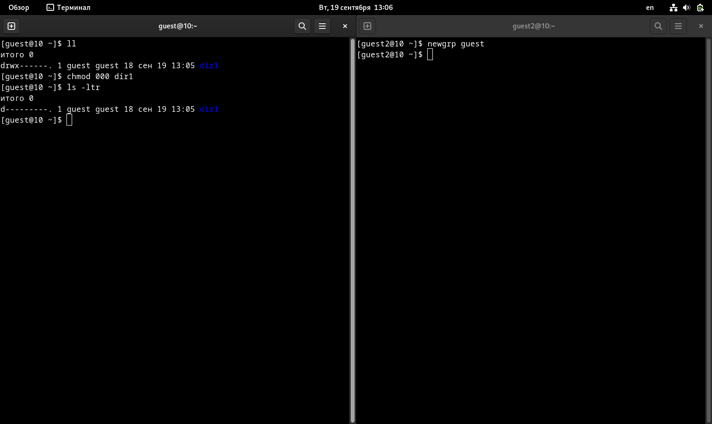
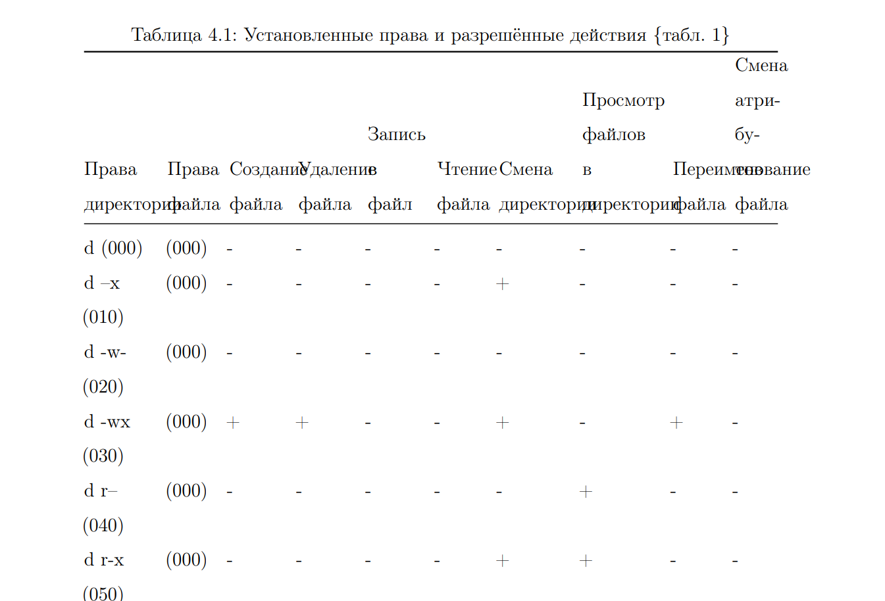

---
## Front matter
lang: ru-RU
title: Отчет по лабораторной работе №3
author: Перелыгин Сергей Викторович

## Formatting
mainfont: PT Serif
romanfont: PT Serif
sansfont: PT Sans
monofont: PT Mono
toc: false
slide_level: 2
theme: metropolis
aspectratio: 40
section-titles: true
---

# Цель работы

## Цель лабораторной работы

Получение практических навыков работы в консоли с атрибутами файлов для групп пользователей.

# Выполнение лабораторной работы

## Начало выполнения работы

Сначала я создал учётную запись пользователя guest и guest2 (использую учётную запись администратора) и задал пароль для пользователя guest и guest2.
Затем добавляю пользователя guest2 в группу guest командой (рис. 1).

{ #fig:001 width=50% }

## Guest и guest2

После этого я осуществил вход в систему от двух пользователей на двух разных консолях: guest на первой консоли и guest2 на второй консоли. Уточнил имена пользователей командой “whoami”. С помощью команд “groups guest” и “groups guest2” определил, что пользователь guest входит в группу guest, а пользователь guest2 в группы guest и guest2. Сравнил полученную информацию с выводом команд “id -Gn guest”, “id -Gn guest2”, “id -G guest” и “id -G guest2”:
данные совпали, за исключением второй команды “id -G”, которая вывела номера групп 1001 и 1002, что также является верным (рис. 2).

---

{ #fig:002 width=70% }

## Изменение атрибутов

От имени пользователя guest2 зарегистрировал этого пользователя в группе guest. Далее от имени пользователя guest изменил права директории /home/guest, разрешив все действия для пользователей группы. От имени этого же пользователя снял с директории /home/guest/dir1 все атрибуты (рис. 3).

{ #fig:003 width=70% }

## Заполняем таблицы

Затем я заполнил таблицы "Установленные права и разрешённые действия" и "Минимальные права для совершения операций".

{ #fig:004 width=70% }

---

{ #fig:005 width=70% }

# Выводы

## Вывод

В ходе выполнения данной лабораторной работы я получил практические навыки работы в консоли с атрибутами файлов для групп пользователей.

---

Спасибо за внимание!

