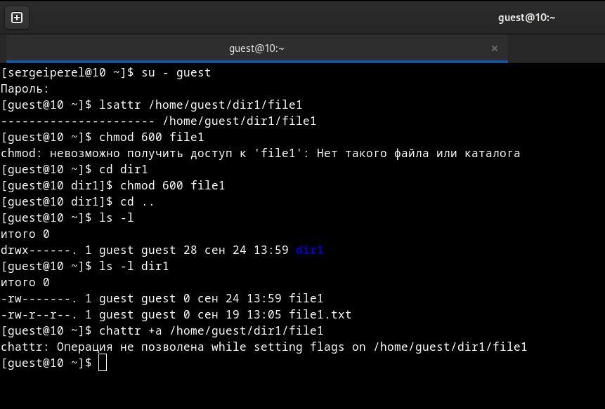
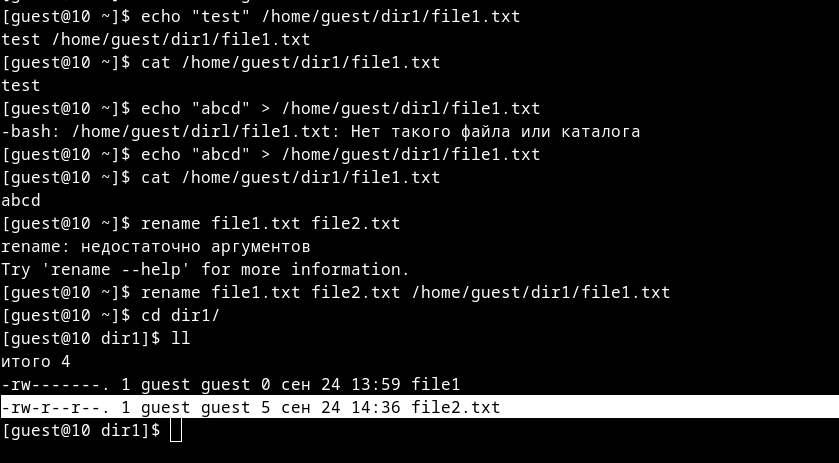
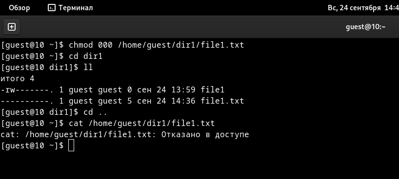
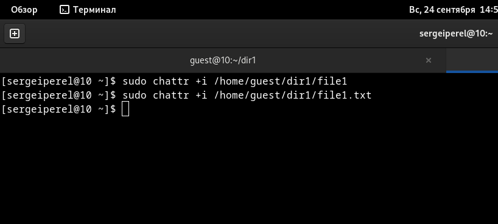

---
## Front matter
lang: ru-RU
title: Отчет по лабораторной работе №4
author: Перелыгин Сергей Викторович

## Formatting
mainfont: PT Serif
romanfont: PT Serif
sansfont: PT Sans
monofont: PT Mono
toc: false
slide_level: 2
theme: metropolis
aspectratio: 40
section-titles: true
---

# Цель работы

## Цель лабораторной работы

Получение практических навыков работы в консоли с расширенными атрибутами файлов.

# Выполнение лабораторной работы

## Начало выполнения работы

От имени пользователя guest определил расширенные атрибуты файла home/guest/dir1/file1 и установил права, разрешающие чтение и запись для владельца файла (рис. 1). От имени суперпользователя установил расширенный атрибут “a” на file1.

{ #fig:001 width=60% }

## Изменение прав доступа

Дозаписал в файл file1 слово “test”. Далее попробовал стереть имеющуюся в файле информацию командой “echo ”abcd” > /home/guest/dirl/file1.txt”, но получил отказ. Попробовал переименовать файл командой "rename" и изменить права доступа командой “chmod 000” (рис. 2 и 3).

{ #fig:002 width=70% }

---

{ #fig:003 width=70% }

## Изменение атрибутов

Снял расширенный атрибут “a” с файла от имени суперпользователя командой “sudo chattr -a /home/guest/dir1/file1” и повторил операции, которые ранее не получилось выполнить - теперь ошибок не было, операции были выполнены.

## Расширенный атрибут “i”

От имени суперпользователя командой “sudo chattr +i /home/guest dir1/file1” установил расширенный атрибут “i” и повторил действия, которые выполнял ранее. В данном случае файл можно было только прочитать, а изменить/записать в него что-то, переименовать и изменить его атрибуты - нельзя (рис. 4).

{ #fig:004 width=70% }

# Выводы

## Вывод

В ходе выполнения данной лабораторной работы я получил практические навыки работы в консоли с расширенными атрибутами файлов, на практике
опробовал действие расширенных атрибутов “a” и “i”.

---

Спасибо за внимание!

