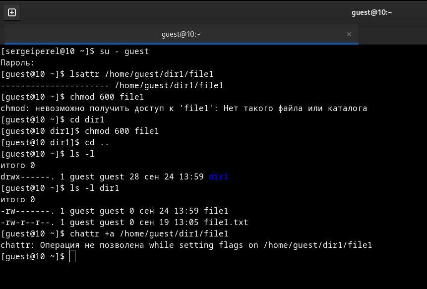
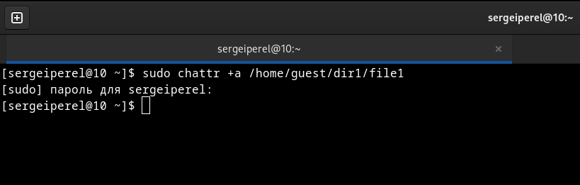
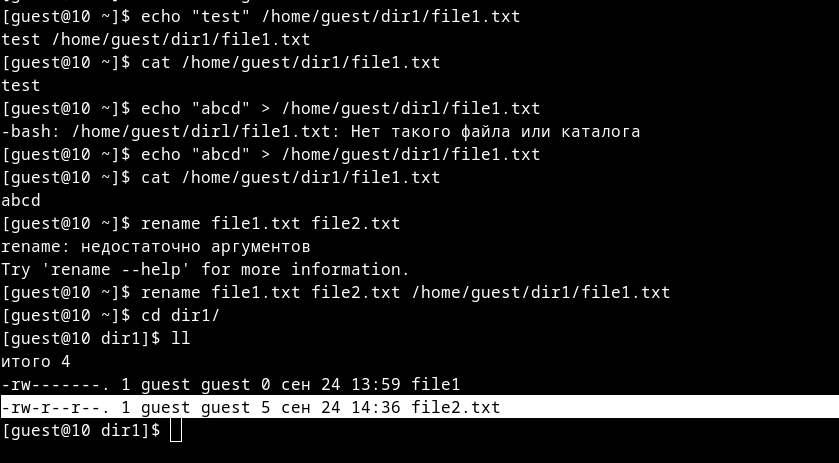
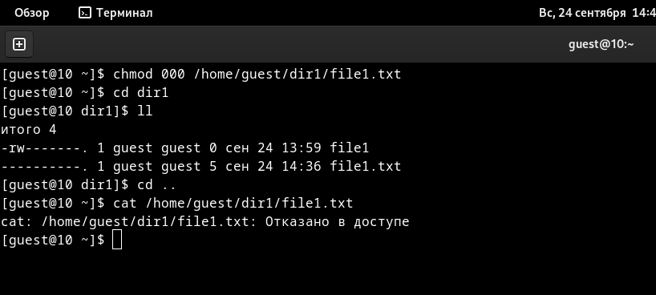
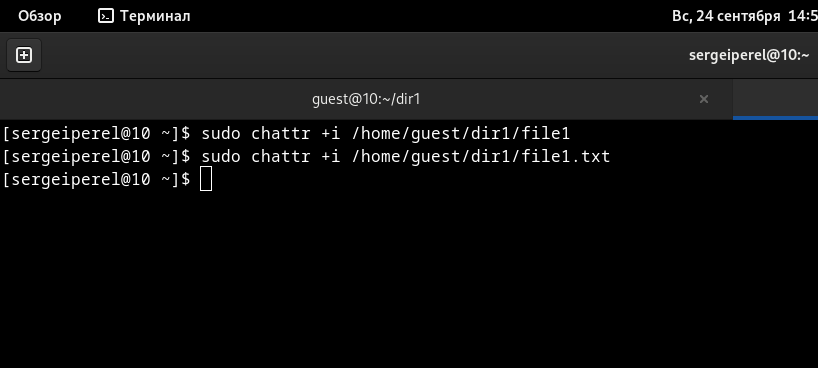
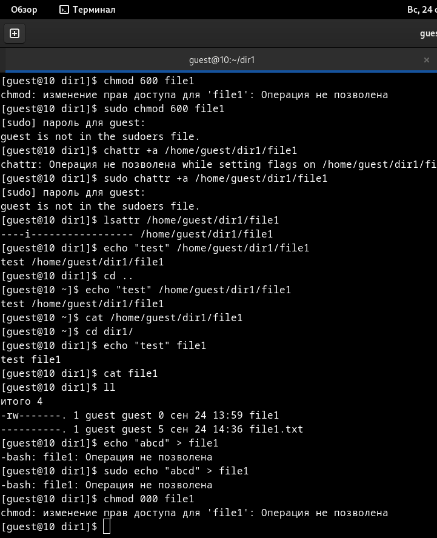
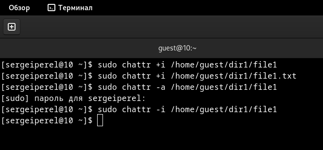
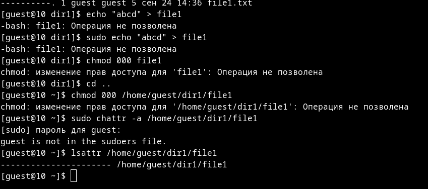

---
# Front matter
lang: ru-RU
title: "Отчёт по лабораторной работе № 4"
subtitle: "Дисциплина:	Основы информационной безопасности"
author: "Перелыгин Сергей Викторович"

# Formatting
toc-title: "Содержание"
toc: true # Table of contents
toc_depth: 2
lof: true # List of figures
fontsize: 12pt
linestretch: 1.5
papersize: a4paper
documentclass: scrreprt
polyglossia-lang: russian
polyglossia-otherlangs: english
mainfont: PT Serif
romanfont: PT Serif
sansfont: PT Sans
monofont: PT Mono
mainfontoptions: Ligatures=TeX
romanfontoptions: Ligatures=TeX
sansfontoptions: Ligatures=TeX,Scale=MatchLowercase
monofontoptions: Scale=MatchLowercase
indent: true
pdf-engine: lualatex
header-includes:
  - \linepenalty=10 # the penalty added to the badness of each line within a paragraph (no associated penalty node) Increasing the value makes tex try to have fewer lines in the paragraph.
  - \interlinepenalty=0 # value of the penalty (node) added after each line of a paragraph.
  - \hyphenpenalty=50 # the penalty for line breaking at an automatically inserted hyphen
  - \exhyphenpenalty=50 # the penalty for line breaking at an explicit hyphen
  - \binoppenalty=700 # the penalty for breaking a line at a binary operator
  - \relpenalty=500 # the penalty for breaking a line at a relation
  - \clubpenalty=150 # extra penalty for breaking after first line of a paragraph
  - \widowpenalty=150 # extra penalty for breaking before last line of a paragraph
  - \displaywidowpenalty=50 # extra penalty for breaking before last line before a display math
  - \brokenpenalty=100 # extra penalty for page breaking after a hyphenated line
  - \predisplaypenalty=10000 # penalty for breaking before a display
  - \postdisplaypenalty=0 # penalty for breaking after a display
  - \floatingpenalty = 20000 # penalty for splitting an insertion (can only be split footnote in standard LaTeX)
  - \raggedbottom # or \flushbottom
  - \usepackage{float} # keep figures where there are in the text
  - \floatplacement{figure}{H} # keep figures where there are in the text
---

# Цель работы

Получение практических навыков работы в консоли с расширенными атрибутами файлов.

# Задание

- Сделать отчёт по лабораторной работе в формате Markdown.
- В качестве отчёта предоставить отчёты в 3 форматах: pdf, docx и md.

# Выполнение лабораторной работы

1. От имени пользователя guest определил расширенные атрибуты файла home/guest/dir1/file1 командой “lsattr /home/guest/dir1/file1”. Командой “chmod 600 /home/guest/dir1/file1” установил права, разрешающие чтение и запись для владельца файла. При попытке использовать команду “chattr +a /home/guest/dir1/file1” для установления расширенного атрибута “a” получил отказ в выполнении операции (рис. 3.1).

{ #fig:001 width=70% }

2. От имени суперпользователя установил расширенный атрибут “a” на
файл командой “sudo chattr +a /home/guest/dir1/file1” и от имени пользователя guest проверил правильность установления атрибута командой “lsattr /home/guest/dir1/file1” (рис. 3.2).

{ #fig:002 width=70% }

3. Дозаписал в файл file1 слово “test” командой “echo”test” » /home/guest/dir1/file1.txt” и, используя команду “cat /home/guest/dir1/file1.txt” убедился, что указанное ранее слово было успешно записано в наш файл. Аналогично записал в файл слово “abcd”. Далее попробовал стереть имеющуюся в файле информацию командой “echo ”abcd” > /home/guest/dirl/file1.txt”, но получил отказ. Попробовал переименовать файл командой “rename file1 file2 /home/guest/dirl/file1” и изменить права доступа командой “chmod 000 /home/guest/dirl/file1” (рис. 3.3 и 3.4).

{ #fig:003 width=70% }

{ #fig:004 width=70% }

4. Снял расширенный атрибут “a” с файла от имени суперпользователя командой “sudo chattr -a /home/guest/dir1/file1” и повторил операции, которые ранее не получилось выполнить - теперь ошибок не было, операции были выполнены.

5. От имени суперпользователя командой “sudo chattr +i /home/guest dir1/file1” установил расширенный атрибут “i” и повторил действия, которые выполнял ранее. В данном случае файл можно было только прочитать, а изменить/записать в него что-то, переименовать и изменить его атрибуты - нельзя (рис. 3.5).

{ #fig:005 width=70% }

{ #fig:006 width=70% }

{ #fig:007 width=70% }

{ #fig:008 width=70% }

# Выводы
**Вывод:** 
В ходе выполнения данной лабораторной работы я получил практические навыки работы в консоли с расширенными атрибутами файлов, на практике
опробовал действие расширенных атрибутов “a” и “i”.

# Библиография

* Медведовский И.Д., Семьянов П.В., Платонов В.В. Атака через Internet. — НПО "Мир и семья-95",  1997. — URL: http://bugtraq.ru/library/books/attack1/index.html
* Медведовский И.Д., Семьянов П.В., Леонов Д.Г.  Атака на Internet. — Издательство ДМК, 1999. — URL: http://bugtraq.ru/library/books/attack/index.html
* Запечников С. В. и др. Информационн~пасность открытых систем. Том 1. — М.: Горячаая линия -Телеком, 2006.
* Введение в информационную безопасность. Типы уязвимостей. (Д.Гамаюнов, МГУ)
* Практические аспекты сетевой безопасности. Вводная лекция. Сетевая безопасность. Стек протоколов TCP/IP. (Д. Гамаюнов, МГУ)
* Практические аспекты сетевой безопасности. Сетевая безопасность. Межсетевые экраны. (В. Иванов, МГУ)
* Практические аспекты сетевой безопасности. Сетевая безопасность. Системы обнаружения и фильтрации компьютерных атак (IDS/IPS). (Д. Гамаюнов, МГУ)
* Практические аспекты сетевой безопасности. Контроль нормального поведения приложений. Security Enhanced Linux (SELinux) (В. Сахаров, МГУ)

