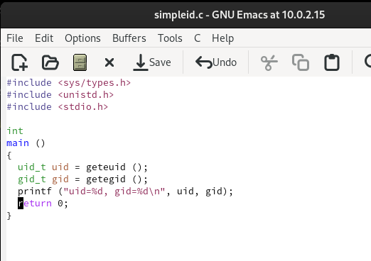
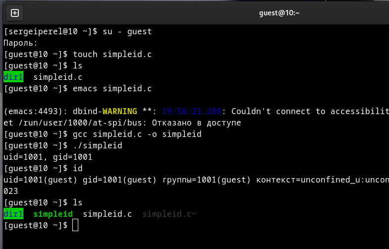
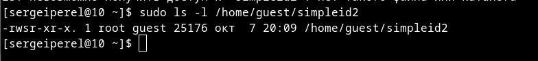
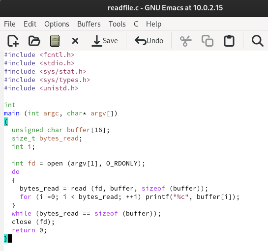
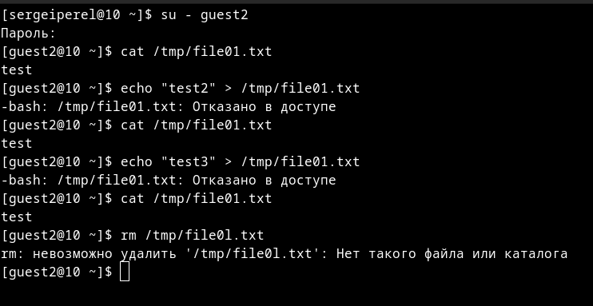

---
## Front matter
lang: ru-RU
title: Отчет по лабораторной работе №5
author: Перелыгин Сергей Викторович

## Formatting
mainfont: PT Serif
romanfont: PT Serif
sansfont: PT Sans
monofont: PT Mono
toc: false
slide_level: 2
theme: metropolis
aspectratio: 40
section-titles: true
---

# Цель работы

## Цель лабораторной работы

Изучить механизмы изменения идентификаторов, применения SetUID- и Sticky-битов. Получить практические навыки работы в консоли с дополнительными атрибутами. Рассмотреть работы механизма смены идентификатора процессов пользователей, а также влияние бита Sticky на запись и удаление файлов.

# Выполнение лабораторной работы

## Начало выполнения работы

Создал программу simpleid.c со следующим текстом 

{ #fig:001 width=60% }

## Работа с созданной программой

Скомпилировал программу с помощью команды gcc и убедился, что файл действительно создан. Далее запустил исполняемый файл. 
Вывод написанной программы совпадает с выводом команды id 

{ #fig:002 width=70% }

## Установка SetUID-бит

От имени суперпользователя сменил владельца файла simpleid2 на root и установил SetUID-бит. 
После этого через команду ls -l убедился, что бит установился корректно 

{ #fig:003 width=70% }

## Работа с программой readfile.c

Создал программу readfile.c 

{ #fig:004 width=70% }

## Наличие Sticky-бита

Проводим над файлом file01.txt следующие действия: читаем его, дозаписываем и перезаписываем информацию, переименовываем. При попытке удаления возникает ошибка.

{ #fig:005 width=70% }

## Изменение Sticky-бита

От имени суперпользователя удаляем sticku-бит командой chmod -t.
Повторяем описанные ранее действия над файлом file01.txt.

{ #fig:006 width=70% }

# Выводы

## Вывод

В ходе выполнения данной лабораторной работы я изучил механизмы изменения идентификаторов, применения SetUID- и Sticky-битов. Получил практические навыки работы в консоли с дополнительными атрибутами. Рассмотрел работы механизма смены идентификатора процессов пользователей, а также влияние бита Sticky на запись и удаление файлов.

---

Спасибо за внимание!

