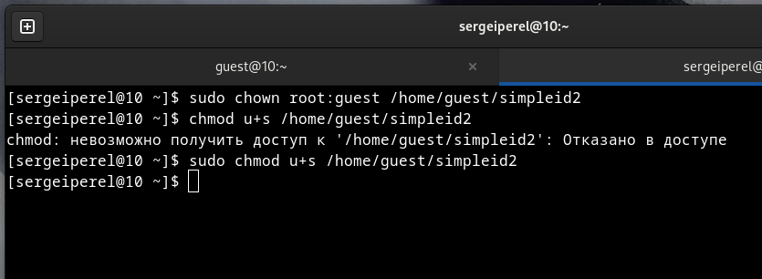

---
# Front matter
lang: ru-RU
title: "Отчёт по лабораторной работе № 5"
subtitle: "Дисциплина:	Основы информационной безопасности"
author: "Перелыгин Сергей Викторович"

# Formatting
toc-title: "Содержание"
toc: true # Table of contents
toc_depth: 2
lof: true # List of figures
fontsize: 12pt
linestretch: 1.5
papersize: a4paper
documentclass: scrreprt
polyglossia-lang: russian
polyglossia-otherlangs: english
mainfont: PT Serif
romanfont: PT Serif
sansfont: PT Sans
monofont: PT Mono
mainfontoptions: Ligatures=TeX
romanfontoptions: Ligatures=TeX
sansfontoptions: Ligatures=TeX,Scale=MatchLowercase
monofontoptions: Scale=MatchLowercase
indent: true
pdf-engine: lualatex
header-includes:
  - \linepenalty=10 # the penalty added to the badness of each line within a paragraph (no associated penalty node) Increasing the value makes tex try to have fewer lines in the paragraph.
  - \interlinepenalty=0 # value of the penalty (node) added after each line of a paragraph.
  - \hyphenpenalty=50 # the penalty for line breaking at an automatically inserted hyphen
  - \exhyphenpenalty=50 # the penalty for line breaking at an explicit hyphen
  - \binoppenalty=700 # the penalty for breaking a line at a binary operator
  - \relpenalty=500 # the penalty for breaking a line at a relation
  - \clubpenalty=150 # extra penalty for breaking after first line of a paragraph
  - \widowpenalty=150 # extra penalty for breaking before last line of a paragraph
  - \displaywidowpenalty=50 # extra penalty for breaking before last line before a display math
  - \brokenpenalty=100 # extra penalty for page breaking after a hyphenated line
  - \predisplaypenalty=10000 # penalty for breaking before a display
  - \postdisplaypenalty=0 # penalty for breaking after a display
  - \floatingpenalty = 20000 # penalty for splitting an insertion (can only be split footnote in standard LaTeX)
  - \raggedbottom # or \flushbottom
  - \usepackage{float} # keep figures where there are in the text
  - \floatplacement{figure}{H} # keep figures where there are in the text
---

# Цель работы

Изучение механизмов изменения идентификаторов, применения SetUID- и Sticky-битов. Получение практических навыков работы в консоли с дополнительными атрибутами. Рассмотрение работы механизма смены идентификатора процессов пользователей, а также влияние бита Sticky на запись и удаление файлов

# Задание

- Сделать отчёт по лабораторной работе в формате Markdown.
- В качестве отчёта предоставить отчёты в 3 форматах: pdf, docx и md.

# Теоретическое введение

SetUID, SetGID и Sticky - это специальные типы разрешений позволяют задавать расширенные права доступа на файлы или каталоги.

• SetUID (set user ID upon execution — «установка ID пользователя во время выполнения) являются флагами прав доступа в Unix, которые разрешают пользователям запускать исполняемые файлы с правами владельца исполняемого файла.
• SetGID (set group ID upon execution — «установка ID группы во время выполнения») являются флагами прав доступа в Unix, которые разрешают пользователям запускать исполняемые файлы с правами группы исполняемого файла.
• Sticky bit в основном используется в общих каталогах, таких как /var или /tmp, поскольку пользователи могут создавать файлы, читать и выполнять их, принадлежащие другим пользователям, но не могут удалять файлы, принадлежащие другим пользователям.

# Выполнение лабораторной работы

1. Для начала я убедился, что компилятор gcc установлен, используя команду “gcc -v”. Затем отключил систему запретов до очередной перезагрузки системы командой “sudo setenforce 0”, после чего команда “getenforce” вывела “Permissive” (рис. 4.1 и 4.2).

{ #fig:001 width=70% }

{ #fig:002 width=70% }

2. Проверил успешное выполнение команд “whereis gcc” и “whereis g++” (их расположение) (рис. 4.3).

{ #fig:003 width=70% }

3. Вошел в систему от имени пользователя guest командой “su - guest”. Создал программу simpleid.c командой “touch simpleid.c” и открыл её в редакторе emacs.

4. Код программы выглядит следующим образом (рис. 4.4).

{ #fig:004 width=70% }

5. Скомпилировал программу и убедился, что файл программы был создан
командой “gcc simpleid.c -o simpleid”. Выполнил программу simpleid командой “./simpleid”, а затем выполнил системную программу id командой “id”. Результаты, полученные в результате выполнения обеих команд, совпадают (uid=1001 и gid=1001) (рис. 4.5).

{ #fig:005 width=70% }

6. Усложнил программу, добавив вывод действительных идентификаторов (рис.
4.6).

{ #fig:006 width=70% }

7. Получившуюся программу назвал simpleid2.c.

8. Скомпилировал и запустил simpleid2.c командами “gcc simpleid2.c -o sipleid2” и “./simpleid2” (рис. 4.7).

{ #fig:007 width=70% }

9. От имени суперпользователя выполнил команды “sudo chown root:guest /home/guest/simpleid2” и “sudo chmod u+s /home/guest/simpleid2” (рис. 4.8), затем выполнил проверку правильности установки новых атрибутов и смены владельца файла simpleid2 командой “sudo ls -l /home/guest/simpleid2” (рис. 4.9). Этими командами была произведена смена пользователя файла на root и установлен SetUID-бит.

{ #fig:008 width=70% }

{ #fig:009 width=70% }

10. Запустил программы simpleid2 и id. Теперь появились различия в uid (рис. 4.10).

{ #fig:010 width=70% }

11. Проделал тоже самое относительно SetGID-бита. Также можем заметить различия с предыдущим пунктом (рис. 4.11).

{ #fig:011 width=70% }

12. Создаем программу readfile.c (рис. 4.12).

{ #fig:012 width=70% }

13. Скомпилировал созданную программу командой “gcc readfile.c -o readfile” (рис. 4.13). Сменил владельца у файла readfile.c командой “sudo chown root:guest /home/guest/readfile.c” и поменял права так, чтобы только суперпользователь мог прочитать его, а guest не мог, с помощью команды “sudo chmod 700 /home/guest/readfile.c” (рис. 4.14). Теперь убедился, что пользователь guest не может прочитать файл readfile.c командой “cat readfile.c”, получив отказ в доступе (рис. 4.15).

{ #fig:013 width=70% }

{ #fig:014 width=70% }

{ #fig:015 width=70% }

14. Поменял владельца у программы readfile и устанавила SetUID. Проверил, может ли программа readfile прочитать файл readfile.c командой “./readfile readfile.c”. Прочитать удалось (рис. 4.16). Аналогично проверил, можно ли прочитать файл /etc/shadow. Прочитать не удалось (рис. 4.17).

{ #fig:016 width=70% }

{ #fig:017 width=70% }

15. Командой “ls -l / | grep tmp” убедился, что атрибут Sticky на директории /tmp установлен. От имени пользователя guest создал файл file01.txt в директории /tmp со словом test командой “echo”test” > /tmp/file01.txt”. Просмотрел атрибуты у только что созданного файла и разрешаем чтение и запись для категории пользователей “все остальные” командами “ls -l /tmp/file01.txt” и “chmod o+rw /tmp/file01.txt” (рис. 4.18).

{ #fig:018 width=70% }

16. От имени пользователя guest2 попробовал прочитать файл командой “cat /tmp/file01.txt” - это удалось. Далее попытался дозаписать в файл слово test2, проверить содержимое файла и записать в файл слово test3, стерев при этом всю имеющуюся в файле информацию - эти операции выполнить не удалось. От имени пользователя guest2 попробовал удалить файл - это не удается, возникает ошибка (рис. 4.19).

{ #fig:019 width=70% }

17. Повысил права до суперпользователя командой “sudo su -” и выполнил команду, снимающую атрибут t с директории /tmp “chmod -t /tmp”. После чего покинул режим суперпользователя командой “exit”. Повторил предыдущие шаги. Теперь мне удалось выполнить все, кроме команды удалить файл file01.txt от имени пользователя, не являющегося его владельцем (рис. 4.20).

{ #fig:020 width=70% }

18. Повысил свои права до суперпользователя и вернул атрибут t на директорию /tmp (рис. 4.21).

{ #fig:021 width=70% }

# Выводы
**Вывод:** 
В ходе выполнения данной лабораторной работы я изучил механизмы изменения идентификаторов, применение SetUID- и Sticky-битов. Получил практические навыки работы в консоли с дополнительными атрибутами. Рассмотрел работу механизма смены идентификатора процессов пользователей, а также влияние бита Sticky на запись и удаление файлов.

# Библиография

* Медведовский И.Д., Семьянов П.В., Платонов В.В. Атака через Internet. — НПО "Мир и семья-95",  1997. — URL: http://bugtraq.ru/library/books/attack1/index.html
* Медведовский И.Д., Семьянов П.В., Леонов Д.Г.  Атака на Internet. — Издательство ДМК, 1999. — URL: http://bugtraq.ru/library/books/attack/index.html
* Запечников С. В. и др. Информационн~пасность открытых систем. Том 1. — М.: Горячаая линия -Телеком, 2006.
* Введение в информационную безопасность. Типы уязвимостей. (Д.Гамаюнов, МГУ)
* Практические аспекты сетевой безопасности. Вводная лекция. Сетевая безопасность. Стек протоколов TCP/IP. (Д. Гамаюнов, МГУ)
* Практические аспекты сетевой безопасности. Сетевая безопасность. Межсетевые экраны. (В. Иванов, МГУ)
* Практические аспекты сетевой безопасности. Сетевая безопасность. Системы обнаружения и фильтрации компьютерных атак (IDS/IPS). (Д. Гамаюнов, МГУ)
* Практические аспекты сетевой безопасности. Контроль нормального поведения приложений. Security Enhanced Linux (SELinux) (В. Сахаров, МГУ)

