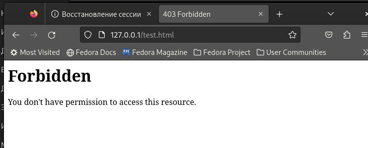

---
## Front matter
lang: ru-RU
title: Отчет по лабораторной работе №6
author: Перелыгин Сергей Викторович

## Formatting
mainfont: PT Serif
romanfont: PT Serif
sansfont: PT Sans
monofont: PT Mono
toc: false
slide_level: 2
theme: metropolis
aspectratio: 40
section-titles: true
---

# Цель работы

## Цель лабораторной работы

Развить навыки администрирования ОС Linux. Получить первое практическое знакомство с технологией SELinux. Проверить работу SELinux на практике совместно с веб-сервером Apache.

# Выполнение лабораторной работы

## Режимы SELunix

С помощью команд getenforce и sestatus убедился, что SELinux работает в режиме enforcing политики targeted (рис. 1).

{ #fig:001 width=70% }

## Веб-сервер Apache

Обратился с помощью браузера к веб-серверу, запущенному на моем компьютере, и убедился, что последний работает с помощью команды “service httpd
status”. С помощью команды “ps auxZ | grep httpd” определил контекст безопасности веб-сервера Apache - httpd_t. Посмотрел текущее состояние переключателей SELinux и статистику по политике с помощью команды “seinfo”.

## Создание основного файла

От имени суперпользователя создал html-файл /var/www/html/test.html (рис. 2).

{ #fig:002 width=70% }

## Просмотр файла в веб-браузере

Обратился к файлу через веб-сервер, введя в браузере адрес “http://127.0.0.1/test.html”. Файл был успешно отображен (рис. 3).

{ #fig:003 width=70% }

## Смена контекста

Изменил контекст файла на samba_share_t командой “sudo chcon -t samba_share_t /var/www/html/test.html” и проверил, что контекст поменялся (рис. 4).

{ #fig:004 width=70% }

## Отказ в доступе

Попробовал еще раз получить доступ к файлу через веб-сервер, введя в браузере адрес “http://127.0.0.1/test.html” и получил сообщение об ошибке (т.к. к установленному ранее контексту процесс httpd не имеет доступа) (рис. 5).

{ #fig:005 width=70% }

## Смена порта

В файле /etc/httpd/conf/httpd.conf заменил строчку “Listen 80” на “Listen 81”, чтобы установить веб-сервер Apache на прослушивание TCP-порта 81 (рис. 6).

{ #fig:006 width=45% }

## Повторный просмотр в веб-браузере

Вернул контекст “httpd_sys_cоntent_t” файлу “/var/www/html/test.html” и после этого попробовал получить доступ к файлу через веб-сервер, введя адрес “http://127.0.0.1:81/test.html”, в результате чего увидел содежимое файла - слово “test” (рис. 7).

{ #fig:006 width=45% }

## Завершение лабораторной работы

Исправил обратно конфигурационный файл apache, вернув “Listen 80”. Попытался удалить привязку http_port к 81 порту командой “semanage port -d -t http_port_t -p tcp 81”, но этот порт определен на уровне политики, поэтому его нельзя удалить. Удалил файл “/var/www/html/test.html” командой “rm /var/www/html/test.html” (рис. 8).

{ #fig:008 width=70% }

# Выводы

## Вывод

В ходе выполнения данной лабораторной работы я развил навыки администрирования ОС Linux, получил первое практическое знакомство с технологией SELinux и проверил работу SELinux на практике совместно с веб-сервером Apache.

---

Спасибо за внимание!

