---
# Front matter
lang: ru-RU
title: "Отчёт по лабораторной работе № 6"
subtitle: "Дисциплина:	Основы информационной безопасности"
author: "Перелыгин Сергей Викторович"

# Formatting
toc-title: "Содержание"
toc: true # Table of contents
toc_depth: 2
lof: true # List of figures
fontsize: 12pt
linestretch: 1.5
papersize: a4paper
documentclass: scrreprt
polyglossia-lang: russian
polyglossia-otherlangs: english
mainfont: PT Serif
romanfont: PT Serif
sansfont: PT Sans
monofont: PT Mono
mainfontoptions: Ligatures=TeX
romanfontoptions: Ligatures=TeX
sansfontoptions: Ligatures=TeX,Scale=MatchLowercase
monofontoptions: Scale=MatchLowercase
indent: true
pdf-engine: lualatex
header-includes:
  - \linepenalty=10 # the penalty added to the badness of each line within a paragraph (no associated penalty node) Increasing the value makes tex try to have fewer lines in the paragraph.
  - \interlinepenalty=0 # value of the penalty (node) added after each line of a paragraph.
  - \hyphenpenalty=50 # the penalty for line breaking at an automatically inserted hyphen
  - \exhyphenpenalty=50 # the penalty for line breaking at an explicit hyphen
  - \binoppenalty=700 # the penalty for breaking a line at a binary operator
  - \relpenalty=500 # the penalty for breaking a line at a relation
  - \clubpenalty=150 # extra penalty for breaking after first line of a paragraph
  - \widowpenalty=150 # extra penalty for breaking before last line of a paragraph
  - \displaywidowpenalty=50 # extra penalty for breaking before last line before a display math
  - \brokenpenalty=100 # extra penalty for page breaking after a hyphenated line
  - \predisplaypenalty=10000 # penalty for breaking before a display
  - \postdisplaypenalty=0 # penalty for breaking after a display
  - \floatingpenalty = 20000 # penalty for splitting an insertion (can only be split footnote in standard LaTeX)
  - \raggedbottom # or \flushbottom
  - \usepackage{float} # keep figures where there are in the text
  - \floatplacement{figure}{H} # keep figures where there are in the text
---

# Цель работы

Развить навыки администрирования ОС Linux. Получить первое практическое знакомство с технологией SELinux. Проверить работу SELinux на практике совместно с веб-сервером Apache.

# Задание

- Сделать отчёт по лабораторной работе в формате Markdown.
- В качестве отчёта предоставить отчёты в 3 форматах: pdf, docx и md.

# Теоретическое введение

SELinux (Security-Enhanced Linux) обеспечивает усиление защиты путем внесения изменений как на уровне ядра, так и на уровне пространства пользователя, что превращает ее в действительно «непробиваемую» операционную систему.
Впервые эта система появилась в четвертой версии CentOS, а в 5 и 6 версии реализация была существенно дополнена и улучшена.
SELinux имеет три основных режим работы:

• Enforcing: Режим по-умолчанию. При выборе этого режима все действия, которые каким-то образом нарушают текущую политику безопасности, будут блокироваться, а попытка нарушения будет зафиксирована в журнале.

• Permissive: В случае использования этого режима, информация о всех действиях, которые нарушают текущую политику безопасности, будут зафиксированы в журнале, но сами действия не будут заблокированы.

• Disabled: Полное отключение системы принудительного контроля доступа.

Политика SELinux определяет доступ пользователей к ролям, доступ ролей к доменам и доступ доменов к типам.
Контекст безопасности — все атрибуты SELinux — роли, типы и домены.
Apache — это свободное программное обеспечение, с помощью которого можно создать веб-сервер. Данный продукт возник как доработанная версия другого HTTP-клиента от национального центра суперкомпьютерных приложений(NCSA).

Для чего нужен Apache сервер:

• чтобы открывать динамические PHP-страницы,

• для распределения поступающей на сервер нагрузки,

• для обеспечения отказоустойчивости сервера,

• чтобы потренироваться в настройке сервера и запуске PHP-скриптов.

Apache является кроссплатформенным ПО и поддерживает такие операционные системы, как Linux, BSD, MacOS, Microsoft, BeOS и другие.

# Выполнение лабораторной работы

1. Вошел в систему под своей учетной записью и убедился, что SELinux работает в режиме enforcing политики targeted с помощью команд “getenforce” и “sestatus” (рис. 4.1).

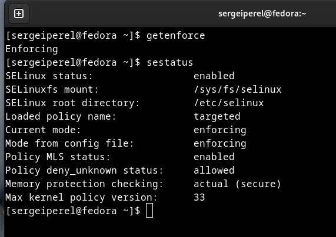{ #fig:001 width=70% }

2. Обратился с помощью браузера к веб-серверу, запущенному на моем компьютере, и убедился, что последний работает с помощью команды “service httpd status” (рис. 4.2).

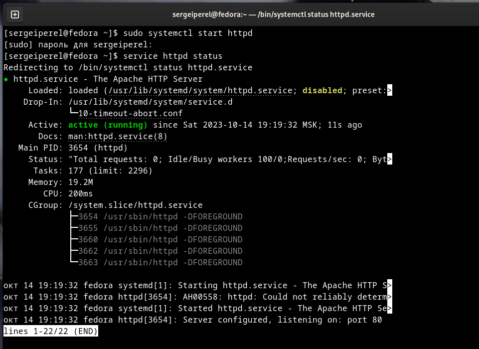{ #fig:002 width=70% }

3. С помощью команды “ps auxZ | grep httpd” определил контекст безопасности веб-сервера Apache - httpd_t (рис. 4.3).

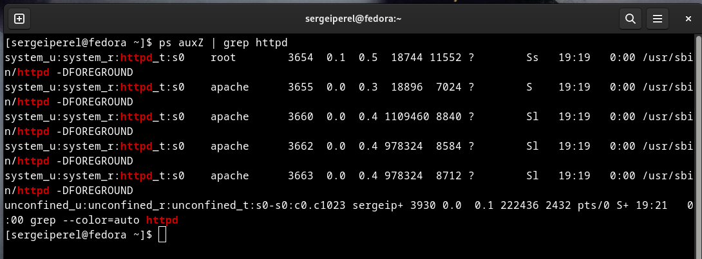{ #fig:003 width=70% }

4. Посмотрел текущее состояние переключателей SELinux для Apache с помощью команды “sestatus -bigrep httpd”, многие из переключателей находятся в положении “off” (рис. 4.4).

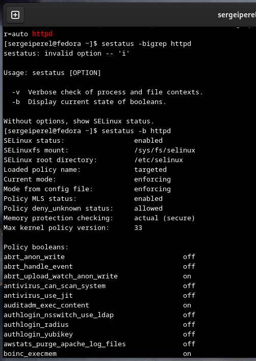{ #fig:004 width=70% }

5. Посмотрел статистику по политике с помощью команды “seinfo”. Множество пользователей - 8, ролей - 14, типов 5116 (рис. 4.5).

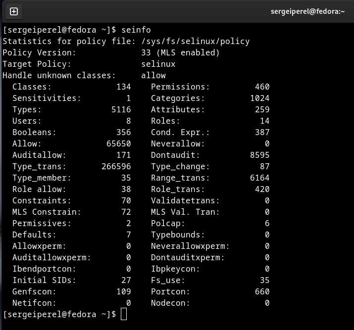{ #fig:005 width=70% }

6. С помощью команды “ls -lZ /var/www” посмотрел файлы и поддиректории,находящиеся в директории /var/www. Используя команду “ls -lZ /var/www/html”, определил, что в данной директории файлов нет. Только владелец/суперпользователь может создавать файлы в директории /var/www/html (рис. 4.6).

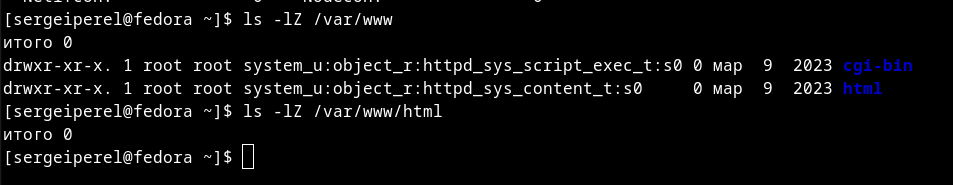{ #fig:006 width=70% }

7. От имени суперпользователя создал html-файл /var/www/html/test.html. Контекст созданного файла - httpd_sys_content_t (рис. 4.7).

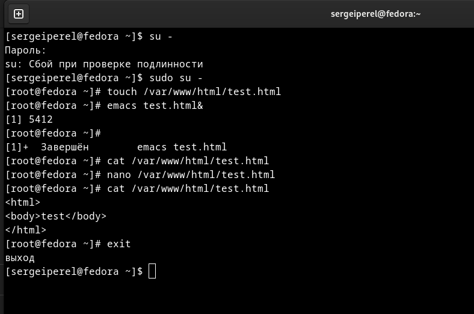{ #fig:007 width=70% }
 
8. Обратился к файлу через веб-сервер, введя в браузере адрес “http://127.0.0.1/test.html”. Файл был успешно отображен (рис. 4.8).

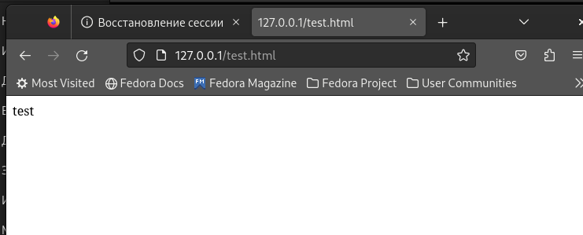{ #fig:008 width=70% }

9. Изучив справку man httpd_selinux, выяснил, что для httpd определены следующие контексты файлов: httpd_sys_content_t, httpd_sys_script_exec_t, httpd_sys_script_ro_t, httpd_sys_script_rw_t, httpd_sys_script_ra_t, httpd_unconfined_script_exec_t. Контекст моего файла - httpd_sys_content_t (в таком случае содержимое должно быть доступно для всех скриптов httpd и для самого демона). Изменил контекст файла на samba_share_t командой “sudo chcon -t samba_share_t /var/www/html/test.html” и проверил, что контекст поменялся (рис. 4.9).

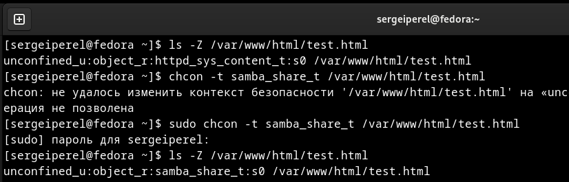{ #fig:009 width=70% }

10. Попробовал еще раз получить доступ к файлу через веб-сервер, введя в браузере адрес “http://127.0.0.1/test.html” и получил сообщение об ошибке (т.к. к установленному ранее контексту процесс httpd не имеет доступа) (рис. 4.10).

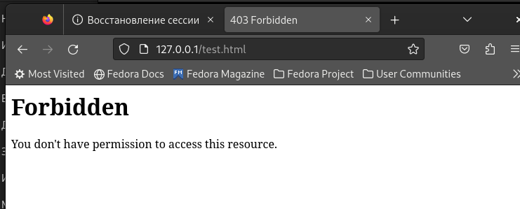{ #fig:010 width=70% }

11. Командой “ls -l /var/www/html/test.html” убедился, что читать данный файл может любой пользователь. Просмотрел системный лог-файл веб-сервера Apache командой “sudo tail /var/log/messages”, отображающий ошибки.

12. В файле /etc/httpd/conf/httpd.conf заменил строчку “Listen 80” на “Listen 81”, чтобы установить веб-сервер Apache на прослушивание TCP-порта 81 (рис. 4.11).

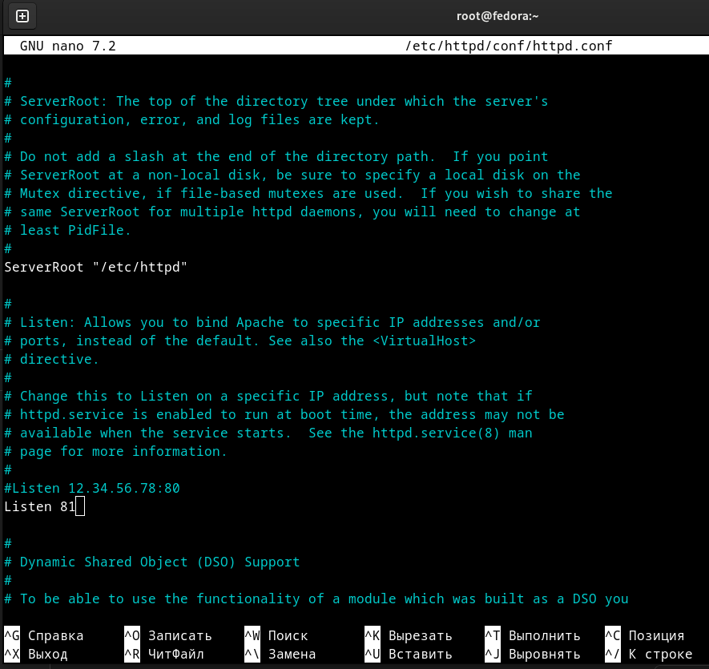{ #fig:011 width=70% }

13. Перезапускаем веб-сервер Apache и анализируем лог-файлы командой “tail -nl /var/log/messages”.

14. Просмотрел файлы “var/log/http/error_log”, “/var/log/http/access_log” и “/var/log/audit/audit.log” и выяснил, что запись появилась в последнем файле (рис. 4.12 - 4.14).

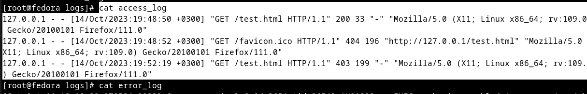{ #fig:012 width=70% }

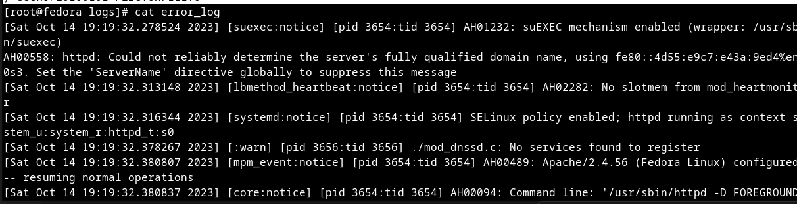{ #fig:013 width=70% }

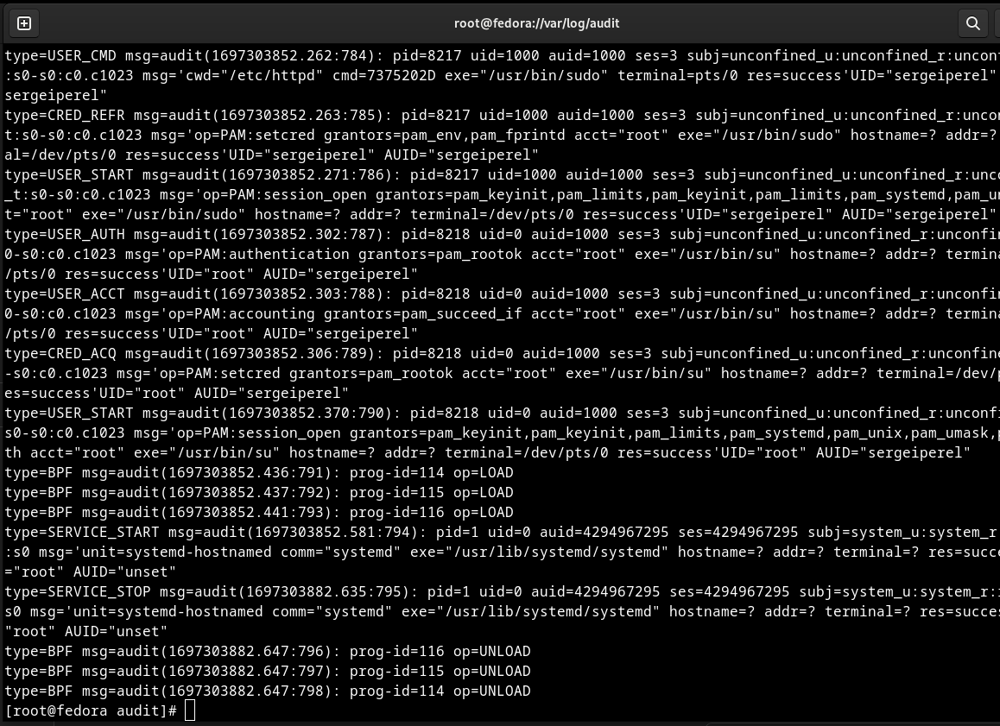{ #fig:014 width=70% }

15. Выполнил команду “semanage port -a -t http_port_t -р tcp 81” и убедился, что порт TCP-81 установлен. Проверил список портов командой “semanage port -l | grep http_port_t”, убедился, что порт 81 есть в списке и запускаем веб-сервер Apache снова (рис. 4.15).

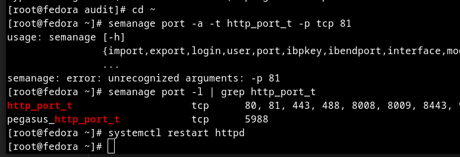{ #fig:015 width=70% }

16. Вернул контекст “httpd_sys_cоntent_t” файлу “/var/www/html/test.html” командой “chcon -t httpd_sys_content_t /var/www/html/test.html” (рис. 4.16) и после этого попробовал получить доступ к файлу через веб-сервер, введя адрес “http://127.0.0.1:81/test.html”, в результате чего увидел содежимое файла - слово “test” (рис. 4.17).

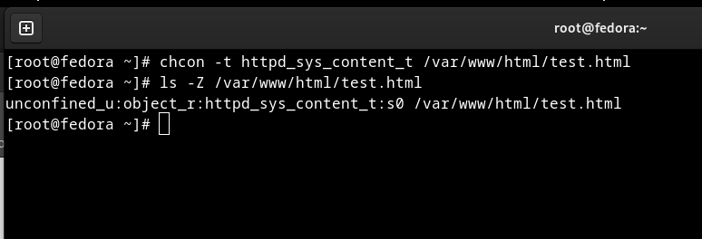{ #fig:016 width=70% }

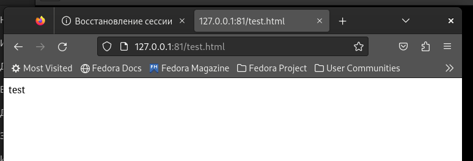{ #fig:017 width=70% }
 
17. Исправил обратно конфигурационный файл apache, вернув “Listen 80”. Попытался удалить привязку http_port к 81 порту командой “semanage port -d -t http_port_t -p tcp 81”, но этот порт определен на уровне политики, поэтому его нельзя удалить (рис. 4.18).

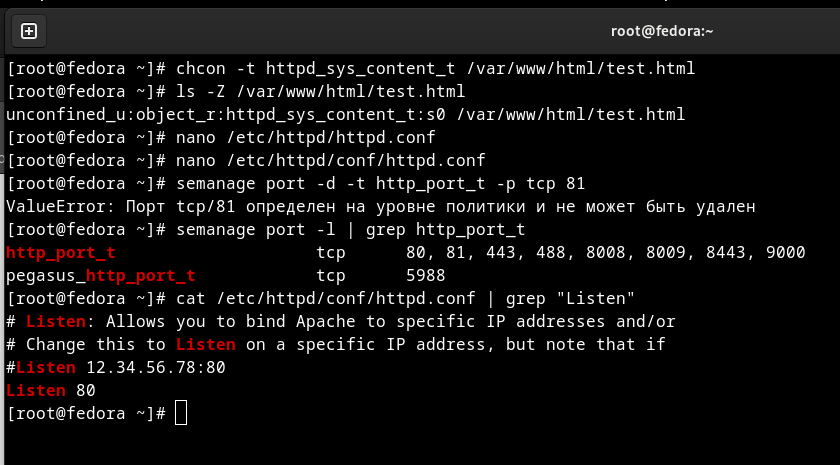{ #fig:018 width=70% }
 
18. Удалил файл “/var/www/html/test.html” командой “rm /var/www/html/test.html” (рис. 4.19).

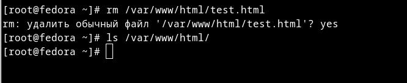{ #fig:019 width=70% }

# Выводы
**Вывод:** 
В ходе выполнения данной лабораторной работы я развил навыки администрирования ОС Linux, получил первое практическое знакомство с технологией SELinux и проверил работу SELinux на практике совместно с веб-сервером Apache.

# Библиография

* Медведовский И.Д., Семьянов П.В., Платонов В.В. Атака через Internet. — НПО "Мир и семья-95",  1997. — URL: http://bugtraq.ru/library/books/attack1/index.html
* Медведовский И.Д., Семьянов П.В., Леонов Д.Г.  Атака на Internet. — Издательство ДМК, 1999. — URL: http://bugtraq.ru/library/books/attack/index.html
* Запечников С. В. и др. Информационн~пасность открытых систем. Том 1. — М.: Горячаая линия -Телеком, 2006.
* Введение в информационную безопасность. Типы уязвимостей. (Д.Гамаюнов, МГУ)
* Практические аспекты сетевой безопасности. Вводная лекция. Сетевая безопасность. Стек протоколов TCP/IP. (Д. Гамаюнов, МГУ)
* Практические аспекты сетевой безопасности. Сетевая безопасность. Межсетевые экраны. (В. Иванов, МГУ)
* Практические аспекты сетевой безопасности. Сетевая безопасность. Системы обнаружения и фильтрации компьютерных атак (IDS/IPS). (Д. Гамаюнов, МГУ)
* Практические аспекты сетевой безопасности. Контроль нормального поведения приложений. Security Enhanced Linux (SELinux) (В. Сахаров, МГУ)

