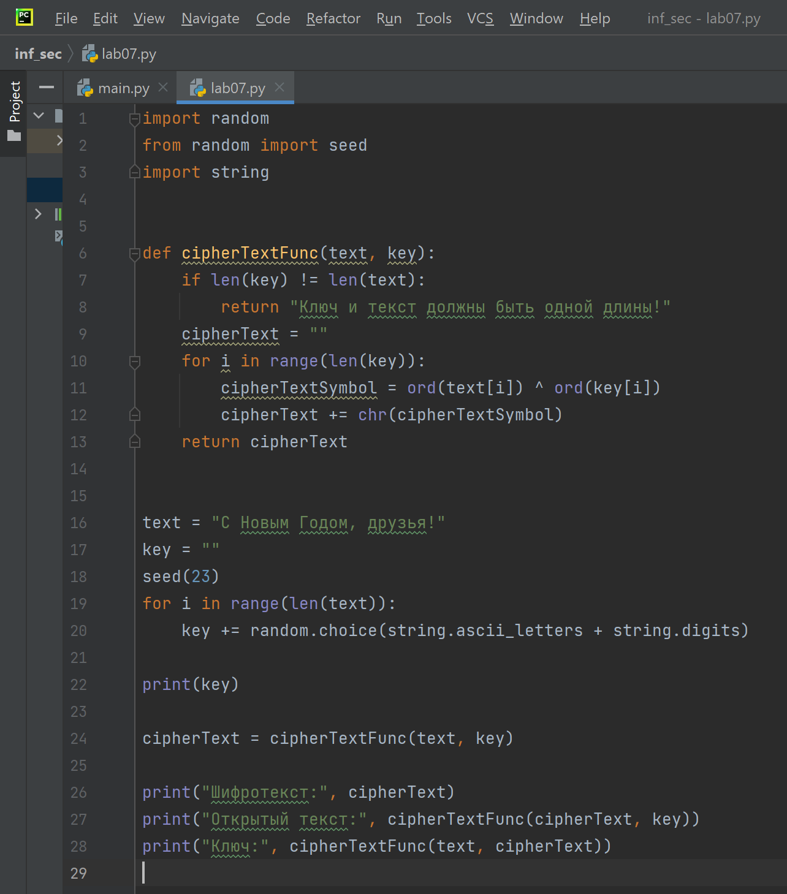
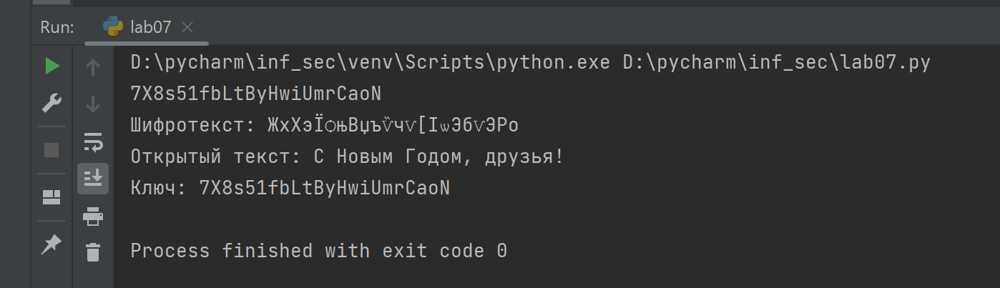

---
## Front matter
lang: ru-RU
title: Отчет по лабораторной работе №7
author: Перелыгин Сергей Викторович

## Formatting
mainfont: PT Serif
romanfont: PT Serif
sansfont: PT Sans
monofont: PT Mono
toc: false
slide_level: 2
theme: metropolis
aspectratio: 40
section-titles: true
---

# Цель работы

## Цель лабораторной работы

Освоить на практике применение режима однократного гаммирования.

# Выполнение лабораторной работы

## Задачи лабораторной работы №7

1. Подобрать ключ, чтобы получить сообщение «С Новым Годом, друзья!».
2. Разработать приложение, позволяющее шифровать и дешифровать данные в режиме однократного гаммирования.

## Теоретическое введение

Гаммирование представляет собой наложение (снятие) на открытые (зашифрованные) данные последовательности элементов других данных, полученной с помощью некоторого криптографического алгоритма, для получения зашифрованных (открытых) данных. Иными словами, наложение гаммы — это сложение её элементов с элементами открытого (закрытого) текста по некоторому фиксированному модулю, значение которого представляет собой известную часть алгоритма шифрования.

## Функция шифрования

Создал функцию, которая осуществляет однократное гаммирование посредством побитового XOR (стр. 6-13). 

{ #fig:001 width=45% }

## Описание программы

Далее я создал ключ той же длины, что и открытый текст, получил шифротекст с помощию функции, созданной ранее, при условии, что известны открытый текст и ключ. После этого получил открытый текст с помощью функции, созданной ранее, при условии, что известны шифротекст и ключ.
Затем я получил ключ с помощью функции, созданной ранее, при условии, что известны открытый текст и шифротекст. 

## Результат работы программы

{ #fig:002 width=70% }

# Выводы

## Вывод

В ходе выполнения данной лабораторной работы я освоил на практике применение режима однократного гаммирования.

---

Спасибо за внимание!

