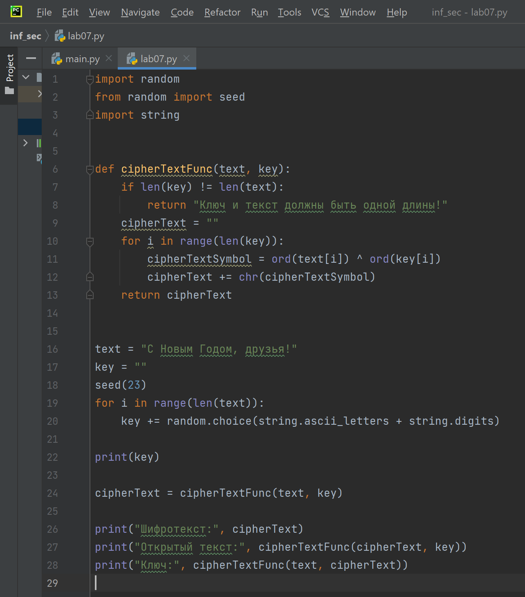
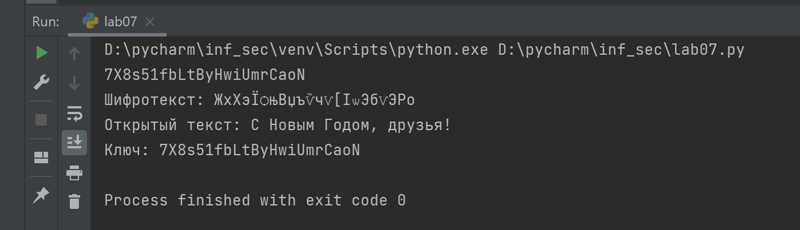

---
# Front matter
lang: ru-RU
title: "Отчёт по лабораторной работе № 7"
subtitle: "Дисциплина:	Основы информационной безопасности"
author: "Перелыгин Сергей Викторович"

# Formatting
toc-title: "Содержание"
toc: true # Table of contents
toc_depth: 2
lof: true # List of figures
fontsize: 12pt
linestretch: 1.5
papersize: a4paper
documentclass: scrreprt
polyglossia-lang: russian
polyglossia-otherlangs: english
mainfont: PT Serif
romanfont: PT Serif
sansfont: PT Sans
monofont: PT Mono
mainfontoptions: Ligatures=TeX
romanfontoptions: Ligatures=TeX
sansfontoptions: Ligatures=TeX,Scale=MatchLowercase
monofontoptions: Scale=MatchLowercase
indent: true
pdf-engine: lualatex
header-includes:
  - \linepenalty=10 # the penalty added to the badness of each line within a paragraph (no associated penalty node) Increasing the value makes tex try to have fewer lines in the paragraph.
  - \interlinepenalty=0 # value of the penalty (node) added after each line of a paragraph.
  - \hyphenpenalty=50 # the penalty for line breaking at an automatically inserted hyphen
  - \exhyphenpenalty=50 # the penalty for line breaking at an explicit hyphen
  - \binoppenalty=700 # the penalty for breaking a line at a binary operator
  - \relpenalty=500 # the penalty for breaking a line at a relation
  - \clubpenalty=150 # extra penalty for breaking after first line of a paragraph
  - \widowpenalty=150 # extra penalty for breaking before last line of a paragraph
  - \displaywidowpenalty=50 # extra penalty for breaking before last line before a display math
  - \brokenpenalty=100 # extra penalty for page breaking after a hyphenated line
  - \predisplaypenalty=10000 # penalty for breaking before a display
  - \postdisplaypenalty=0 # penalty for breaking after a display
  - \floatingpenalty = 20000 # penalty for splitting an insertion (can only be split footnote in standard LaTeX)
  - \raggedbottom # or \flushbottom
  - \usepackage{float} # keep figures where there are in the text
  - \floatplacement{figure}{H} # keep figures where there are in the text
---

# Цель работы

Освоить на практике применение режима однократного гаммирования.

# Задание

- Сделать отчёт по лабораторной работе в формате Markdown.
- В качестве отчёта предоставить отчёты в 3 форматах: pdf, docx и md.

# Теоретическое введение

Гаммирование - наложение (снятие) на открытые (зашифрованные) данны последовательности элементов других данных, полученной с помощью некоторого криптографического алгоритма, для получения зашифрованных (открытых) данных.

Основная формула, необходимая для реализации однократного гаммирования:

Ci = Pi XOR Ki, где Ci - i-й символ зашифрованного текста, Pi - i-й символ открытого текста, Ki - i-й символ ключа.

Аналогичным образом можно найти ключ: Ki = Ci XOR Pi.
Необходимые и достаточные условия абсолютной стойкости шифра:

• длина открытого текста равна длине ключа

• ключ должен использоваться однократно

• ключ должен быть полностью случаен

# Выполнение лабораторной работы

1. Код программы (рис. 4.1) и вывод (рис. 4.2).

{ #fig:001 width=70% }

{ #fig:002 width=70% }

2. Пояснения к программе:

• Lines 1-3: импорт необходимых библиотек

• Lines 6-13: функция, реализующая сложение по модулю два двух строк

• Line 16: открытый/исходный текст

• Lines 17-22: создание ключа той же длины, что и открытый текст

• Lines 24-26: получение шифротекста с помощию функции, созданной ранее, при условии, что известны открытый текст и ключ

• Line 27: получение открытого текста с помощью функции, созданной ранее, при условии, что известны шифротекст и ключ

• Line 28: получение ключа с помощью функции, созданной ранее, при условии, что известны открытый текст и шифротекст

# Выводы
**Вывод:** 
В ходе выполнения данной лабораторной работы я освоил на практике применение режима однократного гаммирования.

# Библиография

* Медведовский И.Д., Семьянов П.В., Платонов В.В. Атака через Internet. — НПО "Мир и семья-95",  1997. — URL: http://bugtraq.ru/library/books/attack1/index.html
* Медведовский И.Д., Семьянов П.В., Леонов Д.Г.  Атака на Internet. — Издательство ДМК, 1999. — URL: http://bugtraq.ru/library/books/attack/index.html
* Запечников С. В. и др. Информационн~пасность открытых систем. Том 1. — М.: Горячаая линия -Телеком, 2006.
* Введение в информационную безопасность. Типы уязвимостей. (Д.Гамаюнов, МГУ)
* Практические аспекты сетевой безопасности. Вводная лекция. Сетевая безопасность. Стек протоколов TCP/IP. (Д. Гамаюнов, МГУ)
* Практические аспекты сетевой безопасности. Сетевая безопасность. Межсетевые экраны. (В. Иванов, МГУ)
* Практические аспекты сетевой безопасности. Сетевая безопасность. Системы обнаружения и фильтрации компьютерных атак (IDS/IPS). (Д. Гамаюнов, МГУ)
* Практические аспекты сетевой безопасности. Контроль нормального поведения приложений. Security Enhanced Linux (SELinux) (В. Сахаров, МГУ)

