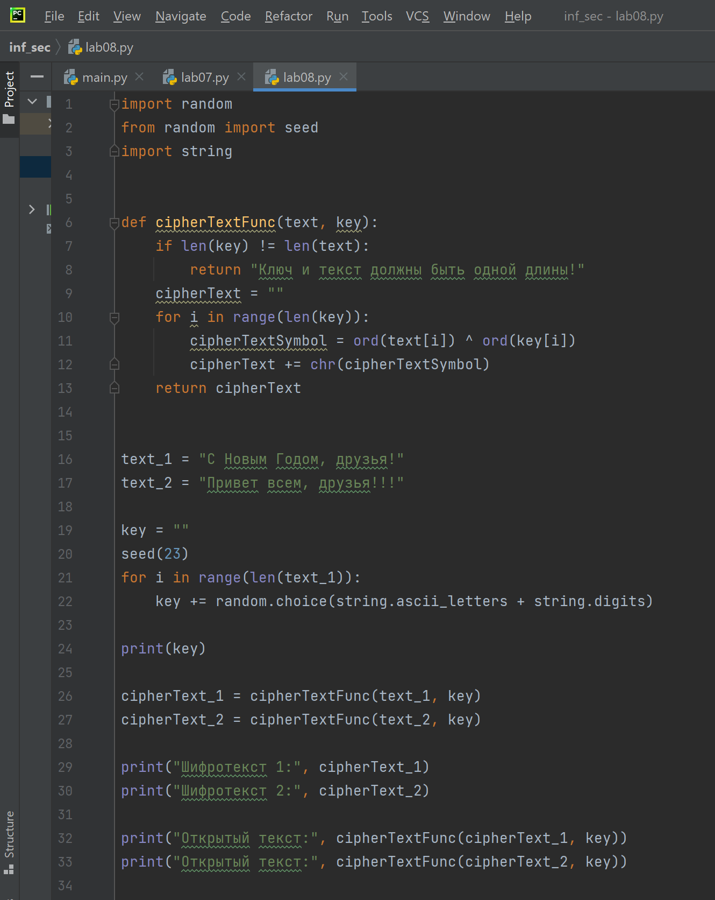
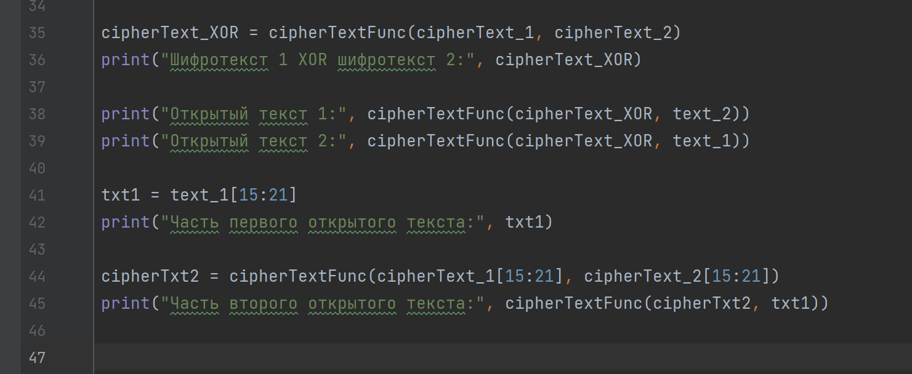
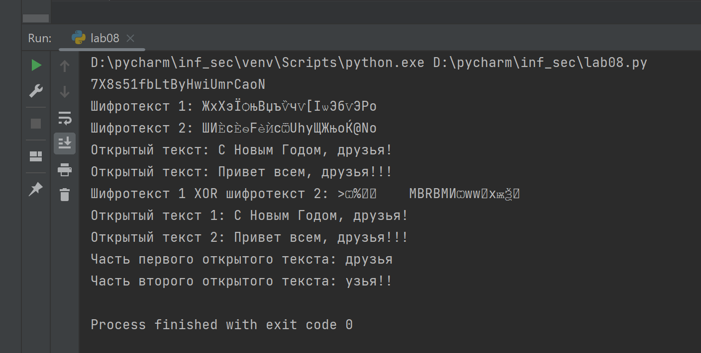

---
## Front matter
lang: ru-RU
title: Отчет по лабораторной работе №8
author: Перелыгин Сергей Викторович

## Formatting
mainfont: PT Serif
romanfont: PT Serif
sansfont: PT Sans
monofont: PT Mono
toc: false
slide_level: 2
theme: metropolis
aspectratio: 40
section-titles: true
---

# Цель работы

## Цель лабораторной работы

Освоить на практике применение режима однократного гаммирования на примере кодирования различных исходных текстов одним ключом.

# Выполнение лабораторной работы

## Задачи лабораторной работы №8

1. Не зная ключа и не стремясь его определить, прочитать оба исходных текста
2. Разработать приложение, позволяющее шифровать и дешифровать тексты в режиме однократного гаммирования
3. Определить и выразить аналитически способ, при котором злоумышленник может прочитать оба текста, не зная ключа и не стремясь его определить.

## Теоретическое введение

Гаммирование представляет собой наложение (снятие) на открытые (зашифрованные) данные последовательности элементов других данных, полученной с помощью некоторого криптографического алгоритма, для получения зашифрованных (открытых) данных. Иными словами, наложение
гаммы — это сложение её элементов с элементами открытого (закрытого)
текста по некоторому фиксированному модулю, значение которого представляет собой известную часть алгоритма шифрования.

## Теоретическое введение

В соответствии с теорией криптоанализа, если в методе шифрования используется однократная вероятностная гамма (однократное гаммирование) той же длины, что и подлежащий сокрытию текст, то текст нельзя раскрыть. Даже при раскрытии части последовательности гаммы нельзя получить информацию о всём скрываемом тексте. Наложение гаммы по сути представляет собой выполнение операции сложения по модулю 2 (XOR) (обозначаемая знаком ⊕) между элементами гаммы и элементами подлежащего сокрытию текста.

## Функция шифрования

Создал функцию, которая осуществляет однократное гаммирование посредством побитового XOR. 

## Описание программы

Создал две строки одинаковой длины. Далее я создал ключ той же длины, что и открытые тексты, получил шифротексты с помощию функции, созданной ранее, при условии, что известны открытые тексты и ключ. После этого получил открытый текст с помощью функции, созданной ранее, при условии, что известны шифротекст и ключ.
Затем я получил открытые тексты с помощью функции, созданной ранее, при условии, что известны шифротексты и ключ. Сложил по модулю два два шифротекста и получил открытые тексты с помощию функции, созданной ранее

## Описание программы

После этого я получил части первого открытого текста (срез), а также часть второго текста (на тех позициях, на которых расположены символы части первого открытого текста) с помощью функции, созданной
ранее, при условии, что известны оба шифротекста и часть первого открытого текста.

## Код программы (часть 1)

{ #fig:001 width=45% }

## Код программы (часть 2)

{ #fig:002 width=70% }

## Результат работы программы

{ #fig:003 width=70% }

# Выводы

## Вывод

В ходе выполнения данной лабораторной работы я освоил на практике применение режима однократного гаммирования на примере кодирования различных исходных текстов одним ключом.

---

Спасибо за внимание!

